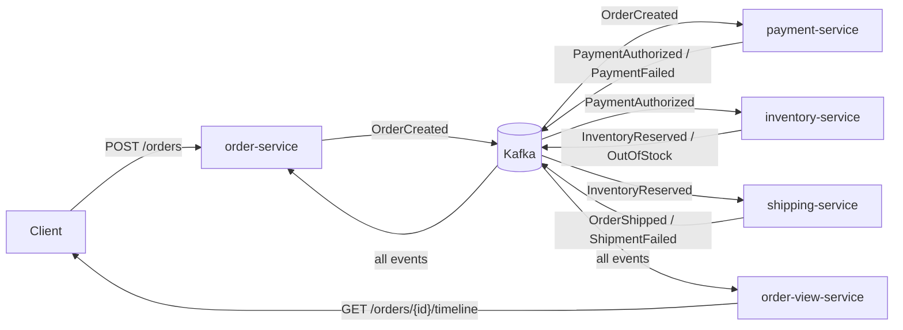
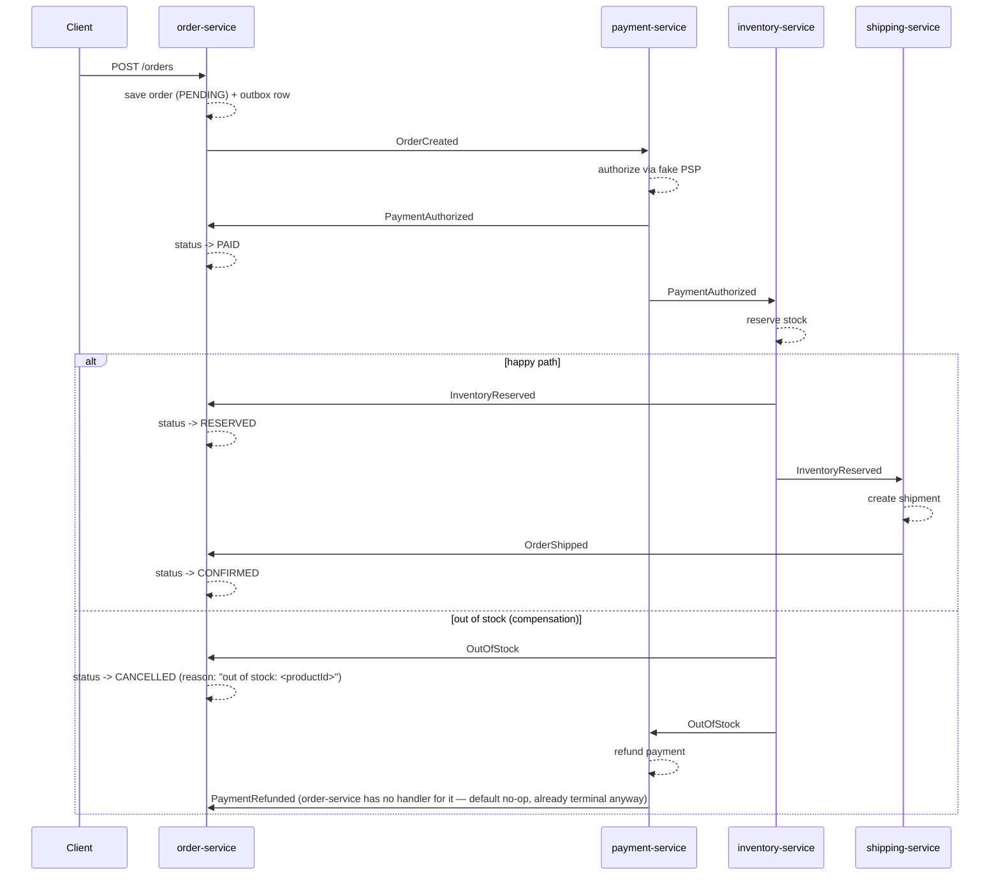
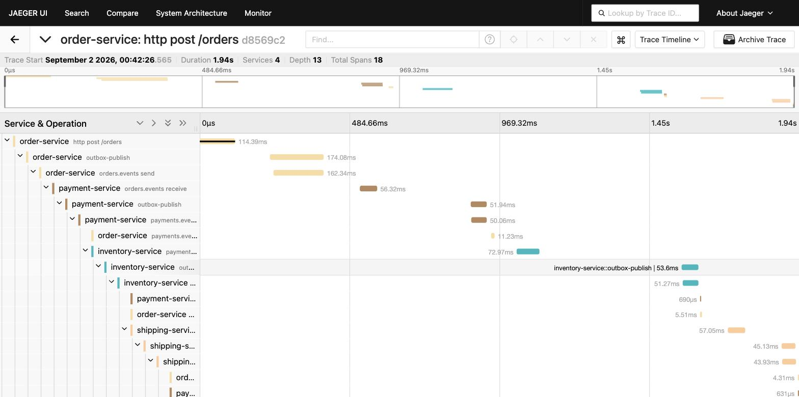

# order-saga


A choreography-based order processing saga over Apache Kafka, built with Spring Boot 3.5 and Java 21.
Four services — order, payment, inventory, shipping — react to each other's events with no central
orchestrator. Each service owns its own Postgres database and publishes through a transactional
**outbox**, consumes **idempotently**, and routes poison messages to a **dead-letter topic** after
exponential-backoff retries. Failure paths run real **compensation**: declined payments never touch
inventory, out-of-stock orders trigger a refund, and a failed shipment releases stock and refunds the
payment. Portfolio project — see [Patterns](#patterns) below for the write-ups.

## Architecture



Each service also owns a Postgres database (`orders_db`, `payments_db`, `inventory_db`,
`shipping_db`) holding its business tables plus an `outbox` table and a `processed_events` table.

## Saga flow

Happy path plus one compensation flow (out-of-stock → refund):



## Patterns

**Transactional outbox.** A consumer that publishes to Kafka *after* committing its DB write can
crash in between — the write lands, the event never does. `OutboxWriter` inserts the event as a row
in the caller's own database transaction instead; a `@Scheduled` `OutboxPublisher` polls unpublished
rows every 500ms and sends them, marking each `published_at` once the send succeeds
(`kafkaTemplate.send(...).join()` — synchronous, to preserve per-aggregate ordering). The DB write and
the "will publish" fact commit atomically; publishing itself is a separate, retryable step. The
polling publisher assumes a single service instance — it does not use `FOR UPDATE SKIP LOCKED` to
claim rows, so running multiple instances would double-publish some events, a case the idempotent
consumers already absorb. The production upgrade path here is Debezium CDC tailing the outbox
table's WAL instead of polling it.

**Idempotent consumers.** Kafka is at-least-once: a rebalance or a retried delivery can hand a
listener the same record twice. Every consumer calls `IdempotencyGuard.firstTime(eventId)` — an
`INSERT ... ON CONFLICT DO NOTHING` into `processed_events` keyed on the event's UUID — as the first
statement inside its transaction. A duplicate delivery finds the row already there, inserts zero
rows, and the handler returns without reapplying the business effect.

**DLT with backoff.** `KafkaErrorConfig` wires a `DefaultErrorHandler` with
`ExponentialBackOffWithMaxRetries(3)` (500ms initial, ×2 multiplier) and a
`DeadLetterPublishingRecoverer`. A handler that keeps throwing gets three retries, then the record is
published to `<consumer-group>.DLT` with failure-reason headers instead of blocking the partition
forever. Separate byte[]/Avro producer templates handle both deserialization failures (poison bytes)
and business-logic failures (an Avro record whose handling code threw).

**Choreography vs. orchestration.** No service centrally directs the saga; each one reacts to events
on the topics it cares about and emits its own result. That keeps services independently deployable
and avoids a single orchestrator becoming a bottleneck / SPOF — the trade-off is that the overall saga
logic is implicit, spread across four codebases, rather than visible in one place. `order-service`
partially compensates for that by consuming every event to project a single current-status view
(`GET /orders/{id}`), which is the closest thing this system has to an orchestrator's-eye view.

**Event enrichment.** `PaymentAuthorized` carries the order's line items forward so inventory-service
never needs a synchronous call back to order-service to find out what to reserve — see the comment on
the record in `common-events`. The trade-off: every consumer of `PaymentAuthorized` gets a payload
that's bigger than strictly needed for payment concerns, and if `OrderItem`'s shape changes,
payment-service (which just relays it) needs a coordinated redeploy too. Acceptable here because the
event schema is small and centrally owned in `common-events`.

### CQRS read model (Kafka Streams)

`order-view-service` has no database of its own. A Kafka Streams topology (`TopologyConfig`) merges
all four topics — `orders.events`, `payments.events`, `inventory.events`, `shipping.events` — into one
stream keyed by order id, then `groupByKey().aggregate(...)` folds each event into a per-order
`OrderTimeline` (current status plus an ordered list of timeline entries) held in a Streams state
store. The fold is idempotent the same way the request-side consumers are, but by event id rather than
an `INSERT ... ON CONFLICT`: `TimelineAggregator` tracks seen `eventId`s on the aggregate itself and
skips a duplicate delivery, since Streams' `at_least_once` processing guarantee can hand the aggregator
the same record twice. `GET /orders/{id}/timeline` (`TimelineController`) doesn't query a database —
it's an **interactive query** straight against the local state store via `KafkaStreams#store(...)`,
so a read never leaves the JVM. The store is serialized with a plain `JsonSerde<OrderTimeline>`
(Spring Kafka's JSON serde) rather than Avro — Avro is the four services' wire format for events in
flight between them, but this store is view-local, never read by another service or replayed as an
event, so there's no cross-service schema to keep compatible. `order-view-service` listens on `8086`
because `8085` is already claimed by Schema Registry's host port mapping in Compose.

### Avro & Schema Registry

Events serialize as Avro against Confluent Schema Registry (`http://localhost:8085` locally,
`schema-registry:8081` inside Compose), one schema per event type under `common-events`. Subjects
register with `RecordNameStrategy`, not the default `TopicNameStrategy`. Of the four topics
(`orders.events`, `payments.events`, `inventory.events`, `shipping.events`), only `orders.events` is
single-type (`OrderCreated`); the other three each carry several distinct event types —
`payments.events` gets `PaymentAuthorized`/`PaymentFailed`/`PaymentRefunded`, `inventory.events` gets
`InventoryReserved`/`OutOfStock`/`InventoryReleased`, `shipping.events` gets
`OrderShipped`/`ShipmentFailed`. `TopicNameStrategy` binds one schema per topic, which would force
each of those topics' event types into a single Avro union schema evolved together.
`RecordNameStrategy` gives each event type — `dev.argontechs.ordersaga.events.OrderCreated` and so
on — its own subject and its own compatibility history, independent of which topic it happens to
ride on. The outbox still stores the event as Avro-JSON text in `OutboxWriter`'s own DB transaction,
not the registry-encoded wire bytes — so a committed order write never depends on the registry being
reachable at write time. `OutboxPublisher` reconstructs the typed record from that JSON and hands it
to the Avro serializer (which does the registry round-trip) only at send time, keeping registry
availability off the write path's critical section. Module tests (`*IT.java`) point
`schema.registry.url` at the literal `mock://ordersaga` — Confluent's in-JVM fake registry — in every
service, deliberately the same value everywhere so the app context and test helpers resolve identical
schema ids within that one in-JVM scope.

**Why auto-create is off.** This bit for real during development: with the broker's topic
auto-create enabled, a consumer's `@KafkaListener` subscribed to a topic *before* the owning
service's `NewTopic` bean had run, and the broker auto-created that topic with its default of 1
partition. By the time the 3-partition `NewTopic` bean for the real topic definition executed, Kafka
already had a topic under that name — `NewTopic` beans don't repartition an existing topic — so every
consumer group on it was permanently stuck with 1 of the intended 3 partitions, silently starving
2/3 of expected parallelism with no error anywhere. The fix is `KAFKA_AUTO_CREATE_TOPICS_ENABLE=false`
in `docker-compose.yml`, plus every topic — including all four `<group>.DLT` topics — declared as an
explicit `NewTopic` bean (see each service's `TopicConfig`). Nothing gets to exist by accident.

### Observability

**Tracing through the outbox.** The transactional outbox (see [Transactional
outbox](#patterns) above) buys delivery safety at a cost: `OutboxPublisher` runs on a
`@Scheduled` thread, not the thread that handled the original HTTP request or Kafka
record. That scheduler thread has no span of its own to inherit — left alone, the trace
would simply end at the outbox write, and Kafka-side spring-kafka observation would start
a brand-new, unrelated trace for the publish. Worse, since every saga service has
`spring.kafka.template.observation-enabled: true`, `KafkaTemplate` wraps every `send()` in
its own Observation that unconditionally injects a `traceparent` header derived from
whatever's active *on that thread* — so even manually copying a header across would get
silently overwritten.

The fix, in `OutboxWriter` and `OutboxPublisher` (`common-messaging`):

1. `OutboxWriter.write(...)` runs inside the caller's own transaction — the same thread
   and span as the original HTTP handler or Kafka listener. It reads the current span's
   W3C `traceparent` via the Micrometer `Tracer`/`Propagator` and stores it in a
   `traceparent` column on the outbox row.
2. `OutboxPublisher.publishPending()` (the `@Scheduled` poll, every 500ms) reads that
   stored `traceparent` back and extracts it into a real `Span` with
   `propagator.extract(...)`. It then opens that span as the *current* span on the
   scheduler thread with `tracer.withSpan(span)` for the duration of `kafkaTemplate.send()`.
   Because a span is now current, `KafkaTemplate`'s own observation re-derives and
   re-injects that same, correctly-parented `traceparent` instead of clobbering it with
   an unrelated one.
3. The consuming service's spring-kafka listener observation extracts that header on
   receipt and parents its new consumer span onto it — continuing the same trace.

Every service sets `management.tracing.sampling.probability: 1.0` — trace every request,
no sampling loss. That's demo posture, chosen so a single order always produces a
complete trace to look at. A production deployment would sample probabilistically (e.g.
1-10%) or tail-sample on error/latency, to bound tracing overhead and backend storage
cost at real traffic volumes.

The result: one Jaeger trace covers a request from `POST /orders` through order-service's
DB write, across the outbox hop, through every Kafka publish/consume pair, all the way
through payment → inventory → shipping (and back to order-service for status updates).
Without the `withSpan` scope in step 2, each outbox-published hop would silently start a
new, disconnected trace — this was an actual observed regression during development, not
a hypothetical.

**Metrics.** All five services (order, payment, inventory, shipping, order-view) bring in
`micrometer-registry-prometheus` and `micrometer-tracing-bridge-otel`, and expose
`management.endpoints.web.exposure.include: health,prometheus`, so each serves scrapeable
metrics at `/actuator/prometheus` — request latency, Kafka consumer lag, listener
processing time, JVM heap, and more, all with per-service labels. `KafkaErrorConfig` wraps
the DLT recoverer with a counter increment on every dead-letter publish, so the retry
exhaustion path from [DLT with backoff](#patterns) is itself observable as
`ordersaga.dlt.messages{group=<consumer-group>}`, without touching DLT routing.
`infra/prometheus.yml` scrapes all five `/actuator/prometheus` endpoints every 5s, and a
Grafana dashboard (uid `order-saga`, provisioned from `infra/grafana/provisioning/`) loads
automatically with panels for HTTP p95 latency per service, HTTP request rate, Kafka
consumer max lag, Kafka listener processing p95, JVM heap used per service, and DLT
messages total.

**How to run it.** Tracing (Jaeger) is base infra and comes up with any profile; metrics
(Prometheus + Grafana) sit behind their own `obs` profile:

```bash
docker compose --profile app --profile obs up --build
```

- Jaeger UI — `http://localhost:16686` (search by service name, e.g. `order-service`)
- Prometheus — `http://localhost:9090`
- Grafana — `http://localhost:3000` (anonymous viewer access enabled locally; the "Order
  Saga" dashboard is provisioned automatically, no manual import needed)

One trace, the whole saga — `POST /orders` through payment, inventory, and shipping across
three outbox hops (18 spans, 4 services):



<!-- A Grafana dashboard screenshot will land at docs/img/grafana-dashboard.png once
     captured; run the stack locally per the instructions above to see it live. -->

## Quickstart

```bash
docker compose up -d                                  # infra only, run services from IDE
# or the whole system:
mvn -DskipTests package
docker compose --profile app up --build
# add tracing + metrics UIs (Jaeger is base infra either way):
docker compose --profile app --profile obs up --build
```

Jaeger is `http://localhost:16686` no matter which profile you run. With `--profile obs`
also added, Prometheus is `http://localhost:9090` and Grafana (dashboard auto-provisioned)
is `http://localhost:3000`.

> The Compose credentials (`postgres` / `postgres`) and the Kafka `PLAINTEXT` listener are
> local-development placeholders only — never use them as production values.

Services listen on: order-service `8081`, payment-service `8082`, inventory-service `8083`,
shipping-service `8084`, order-view-service `8086`. Kafka is reachable from the host at
`localhost:9092`. Schema Registry is at `http://localhost:8085` (container 8081, remapped to avoid
the order-service port — which is also why order-view-service takes `8086` instead of `8085`).

## Demo script

```bash
# happy path — 2x P100 @ 49.90 (well under the decline threshold, plenty of stock) -> CONFIRMED
curl -s -X POST localhost:8081/orders -H 'Content-Type: application/json' -d '{
  "customerId": "demo-1",
  "items": [{"productId": "P100", "quantity": 2, "unitPrice": 49.90}]
}'

# declined by PSP — 3x P100 @ 5000.00, total 15000.00 >= the 10000.00 threshold -> CANCELLED
curl -s -X POST localhost:8081/orders -H 'Content-Type: application/json' -d '{
  "customerId": "demo-2",
  "items": [{"productId": "P100", "quantity": 3, "unitPrice": 5000.00}]
}'

# out of stock — 50x P200 @ 10.00 (only 5 in stock) -> CANCELLED, payment refunded
curl -s -X POST localhost:8081/orders -H 'Content-Type: application/json' -d '{
  "customerId": "demo-3",
  "items": [{"productId": "P200", "quantity": 50, "unitPrice": 10.00}]
}'

# poll status (swap in the orderId from any response above)
curl -s localhost:8081/orders/<orderId> | jq

# full event timeline for that order, from the Kafka Streams read model
curl -s localhost:8086/orders/<orderId>/timeline | jq
```

`payment-service`'s fake PSP also has a random failure rate, independent of the deterministic
threshold above — set via `PSP_FAILURE_RATE` (env) / `psp.failure-rate` (property, default `0.0`).
`shipping-service` has the same knob for carrier failures: `SHIPPING_FAILURE_RATE` /
`shipping.failure-rate`. Either lets you demo compensation without hand-picking amounts.

To watch a poison message land in a dead-letter topic (from the host, once the stack is up):

```bash
docker compose exec kafka /opt/kafka/bin/kafka-console-consumer.sh \
  --bootstrap-server localhost:19092 \
  --topic payment-service.DLT --from-beginning
```

Swap `payment-service.DLT` for `order-service.DLT`, `inventory-service.DLT`, or
`shipping-service.DLT` to watch the other three consumer groups.

## Test matrix

| Layer | Command | Requires |
|---|---|---|
| Unit + integration (Testcontainers: Kafka + Postgres per service) | `mvn test` or `mvn verify` | Docker running |
| End-to-end (full composed stack, black-box HTTP) | `mvn -DskipTests package && docker compose --profile app up --build -d && mvn -pl e2e-tests test -De2e && docker compose --profile app down` | Docker running, ports 8081-8084/5432/9092 free |

There's no separate failsafe/IT phase here — each service's `*IT.java` (Testcontainers: Kafka +
Postgres) runs under plain surefire, so `mvn test` and `mvn verify` both already need Docker running;
`verify` doesn't add more test execution, just the rest of the lifecycle. Neither runs e2e — the
`e2e-tests` module skips its tests unless `-De2e` is passed, since they need the whole composed
stack (not just Testcontainers) already up and reachable on `localhost:8081`. CI runs both: `build`
runs `mvn verify`, and `e2e` (depending on `build`) builds images, brings the stack up, runs the e2e
suite, and tears it down regardless of outcome.

Idempotency-guard and DLT/backoff integration tests live only in `payment-service`, used as the
representative service, since the guard and the error handler are shared `common-messaging` code
paths exercised identically by every consumer — a deliberate spec deviation rather than a gap.

## Roadmap

Built in four phases, all complete — the spec lives at
[`docs/superpowers/specs/2026-09-01-order-saga-design.md`](docs/superpowers/specs/2026-09-01-order-saga-design.md).

- ~~**Phase 2 — Schema Registry + Avro.** Migrate events from JSON to Avro-with-Confluent-Schema-Registry,
  add the registry service to Compose.~~ Done — see [Avro & Schema Registry](#avro--schema-registry)
  above. A production posture would go further: pre-register schemas instead of relying on
  `auto.register.schemas` (default `true` here), set `BACKWARD_TRANSITIVE` compatibility on each
  subject, and gate compatibility checks in CI with the `kafka-schema-registry-maven-plugin` — schemas
  here auto-register on first publish for demo simplicity.
- ~~**Phase 3 — Kafka Streams read model.** An `order-view-service` with no database of its own,
  materializing a full per-order event timeline from all four topics via a Streams topology, exposed
  through interactive queries (`GET /orders/{id}/timeline`).~~ Done — see
  [CQRS read model (Kafka Streams)](#cqrs-read-model-kafka-streams) above.
- ~~**Phase 4 — Observability.** Micrometer + OpenTelemetry tracing to Jaeger (one order's trace across
  all four services and every Kafka hop), plus Prometheus + Grafana dashboards for consumer lag,
  throughput, and DLT counts.~~ Done — see [Observability](#observability) above. Trace continuity
  across the outbox hop (the part that actually breaks by default) required the `traceparent` column
  + `withSpan` scope trick described there; a live trace screenshot is in the Observability section,
  and the Grafana dashboard can be seen by running the stack locally per that section.
