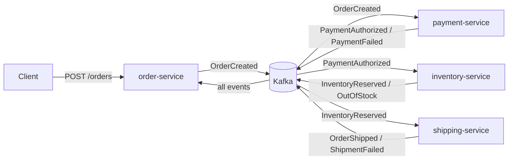
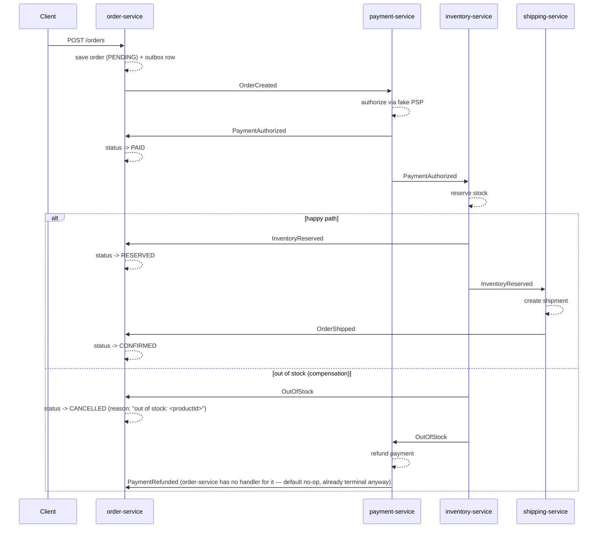

# order-saga


A choreography-based order processing saga over Apache Kafka, built with Spring Boot 3.5 and Java 21.
Four services — order, payment, inventory, shipping — react to each other's events with no central
orchestrator. Each service owns its own Postgres database and publishes through a transactional
**outbox**, consumes **idempotently**, and routes poison messages to a **dead-letter topic** after
exponential-backoff retries. Failure paths run real **compensation**: declined payments never touch
inventory, out-of-stock orders trigger a refund, and a failed shipment releases stock and refunds the
payment. Portfolio project — see [Patterns](#patterns) below for the write-ups.

## Architecture



Each service also owns a Postgres database (`orders_db`, `payments_db`, `inventory_db`,
`shipping_db`) holding its business tables plus an `outbox` table and a `processed_events` table.

## Saga flow

Happy path plus one compensation flow (out-of-stock → refund):



## Patterns

**Transactional outbox.** A consumer that publishes to Kafka *after* committing its DB write can
crash in between — the write lands, the event never does. `OutboxWriter` inserts the event as a row
in the caller's own database transaction instead; a `@Scheduled` `OutboxPublisher` polls unpublished
rows every 500ms and sends them, marking each `published_at` once the send succeeds
(`kafkaTemplate.send(...).join()` — synchronous, to preserve per-aggregate ordering). The DB write and
the "will publish" fact commit atomically; publishing itself is a separate, retryable step. The
polling publisher assumes a single service instance — it does not use `FOR UPDATE SKIP LOCKED` to
claim rows, so running multiple instances would double-publish some events, a case the idempotent
consumers already absorb. The production upgrade path here is Debezium CDC tailing the outbox
table's WAL instead of polling it.

**Idempotent consumers.** Kafka is at-least-once: a rebalance or a retried delivery can hand a
listener the same record twice. Every consumer calls `IdempotencyGuard.firstTime(eventId)` — an
`INSERT ... ON CONFLICT DO NOTHING` into `processed_events` keyed on the event's UUID — as the first
statement inside its transaction. A duplicate delivery finds the row already there, inserts zero
rows, and the handler returns without reapplying the business effect.

**DLT with backoff.** `KafkaErrorConfig` wires a `DefaultErrorHandler` with
`ExponentialBackOffWithMaxRetries(3)` (500ms initial, ×2 multiplier) and a
`DeadLetterPublishingRecoverer`. A handler that keeps throwing gets three retries, then the record is
published to `<consumer-group>.DLT` with failure-reason headers instead of blocking the partition
forever. Separate byte[]/JSON producer templates handle both deserialization failures (poison bytes)
and business-logic failures (a JSON-shaped record whose handling code threw).

**Choreography vs. orchestration.** No service centrally directs the saga; each one reacts to events
on the topics it cares about and emits its own result. That keeps services independently deployable
and avoids a single orchestrator becoming a bottleneck / SPOF — the trade-off is that the overall saga
logic is implicit, spread across four codebases, rather than visible in one place. `order-service`
partially compensates for that by consuming every event to project a single current-status view
(`GET /orders/{id}`), which is the closest thing this system has to an orchestrator's-eye view.

**Event enrichment.** `PaymentAuthorized` carries the order's line items forward so inventory-service
never needs a synchronous call back to order-service to find out what to reserve — see the comment on
the record in `common-events`. The trade-off: every consumer of `PaymentAuthorized` gets a payload
that's bigger than strictly needed for payment concerns, and if `OrderItem`'s shape changes,
payment-service (which just relays it) needs a coordinated redeploy too. Acceptable here because the
event schema is small and centrally owned in `common-events`.

**Why auto-create is off.** This bit for real during development: with the broker's topic
auto-create enabled, a consumer's `@KafkaListener` subscribed to a topic *before* the owning
service's `NewTopic` bean had run, and the broker auto-created that topic with its default of 1
partition. By the time the 3-partition `NewTopic` bean for the real topic definition executed, Kafka
already had a topic under that name — `NewTopic` beans don't repartition an existing topic — so every
consumer group on it was permanently stuck with 1 of the intended 3 partitions, silently starving
2/3 of expected parallelism with no error anywhere. The fix is `KAFKA_AUTO_CREATE_TOPICS_ENABLE=false`
in `docker-compose.yml`, plus every topic — including all four `<group>.DLT` topics — declared as an
explicit `NewTopic` bean (see each service's `TopicConfig`). Nothing gets to exist by accident.

## Quickstart

```bash
docker compose up -d                                  # infra only, run services from IDE
# or the whole system:
mvn -DskipTests package
docker compose --profile app up --build
```

> The Compose credentials (`postgres` / `postgres`) and the Kafka `PLAINTEXT` listener are
> local-development placeholders only — never use them as production values.

Services listen on: order-service `8081`, payment-service `8082`, inventory-service `8083`,
shipping-service `8084`. Kafka is reachable from the host at `localhost:9092`. Schema Registry is at
`http://localhost:8085`.

## Demo script

```bash
# happy path — 2x P100 @ 49.90 (well under the decline threshold, plenty of stock) -> CONFIRMED
curl -s -X POST localhost:8081/orders -H 'Content-Type: application/json' -d '{
  "customerId": "demo-1",
  "items": [{"productId": "P100", "quantity": 2, "unitPrice": 49.90}]
}'

# declined by PSP — 3x P100 @ 5000.00, total 15000.00 >= the 10000.00 threshold -> CANCELLED
curl -s -X POST localhost:8081/orders -H 'Content-Type: application/json' -d '{
  "customerId": "demo-2",
  "items": [{"productId": "P100", "quantity": 3, "unitPrice": 5000.00}]
}'

# out of stock — 50x P200 @ 10.00 (only 5 in stock) -> CANCELLED, payment refunded
curl -s -X POST localhost:8081/orders -H 'Content-Type: application/json' -d '{
  "customerId": "demo-3",
  "items": [{"productId": "P200", "quantity": 50, "unitPrice": 10.00}]
}'

# poll status (swap in the orderId from any response above)
curl -s localhost:8081/orders/<orderId> | jq
```

`payment-service`'s fake PSP also has a random failure rate, independent of the deterministic
threshold above — set via `PSP_FAILURE_RATE` (env) / `psp.failure-rate` (property, default `0.0`).
`shipping-service` has the same knob for carrier failures: `SHIPPING_FAILURE_RATE` /
`shipping.failure-rate`. Either lets you demo compensation without hand-picking amounts.

To watch a poison message land in a dead-letter topic (from the host, once the stack is up):

```bash
docker compose exec kafka /opt/kafka/bin/kafka-console-consumer.sh \
  --bootstrap-server localhost:19092 \
  --topic payment-service.DLT --from-beginning
```

Swap `payment-service.DLT` for `order-service.DLT`, `inventory-service.DLT`, or
`shipping-service.DLT` to watch the other three consumer groups.

## Test matrix

| Layer | Command | Requires |
|---|---|---|
| Unit + integration (Testcontainers: Kafka + Postgres per service) | `mvn test` or `mvn verify` | Docker running |
| End-to-end (full composed stack, black-box HTTP) | `mvn -DskipTests package && docker compose --profile app up --build -d && mvn -pl e2e-tests test -De2e && docker compose --profile app down` | Docker running, ports 8081-8084/5432/9092 free |

There's no separate failsafe/IT phase here — each service's `*IT.java` (Testcontainers: Kafka +
Postgres) runs under plain surefire, so `mvn test` and `mvn verify` both already need Docker running;
`verify` doesn't add more test execution, just the rest of the lifecycle. Neither runs e2e — the
`e2e-tests` module skips its tests unless `-De2e` is passed, since they need the whole composed
stack (not just Testcontainers) already up and reachable on `localhost:8081`. CI runs both: `build`
runs `mvn verify`, and `e2e` (depending on `build`) builds images, brings the stack up, runs the e2e
suite, and tears it down regardless of outcome.

Idempotency-guard and DLT/backoff integration tests live only in `payment-service`, used as the
representative service, since the guard and the error handler are shared `common-messaging` code
paths exercised identically by every consumer — a deliberate spec deviation rather than a gap.

## Roadmap

This is phase 1 of a 4-phase plan; see the design spec at
[`docs/superpowers/specs/2026-09-01-order-saga-design.md`](docs/superpowers/specs/2026-09-01-order-saga-design.md).

- **Phase 2 — Schema Registry + Avro.** Migrate events from JSON to Avro-with-Confluent-Schema-Registry,
  add the registry service to Compose, get compile-time/CI schema-compatibility checking.
- **Phase 3 — Kafka Streams read model.** An `order-view-service` with no database of its own,
  materializing a full per-order event timeline from all four topics via a Streams topology, exposed
  through interactive queries (`GET /orders/{id}/timeline`).
- **Phase 4 — Observability.** Micrometer + OpenTelemetry tracing to Jaeger (one order's trace across
  all four services and every Kafka hop), plus Prometheus + Grafana dashboards for consumer lag,
  throughput, and DLT counts.
