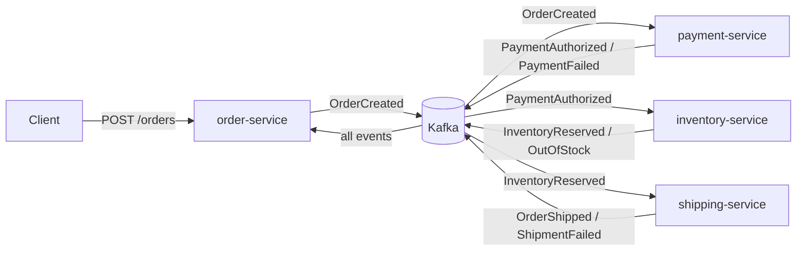

# Core Saga (Phase 1) Implementation Plan

> **For agentic workers:** REQUIRED SUB-SKILL: Use superpowers:subagent-driven-development (recommended) or superpowers:executing-plans to implement this plan task-by-task. Steps use checkbox (`- [ ]`) syntax for tracking.

**Goal:** Four Spring Boot services running a choreography saga over Kafka — order → payment → inventory → shipping — with transactional outbox, idempotent consumers, dead-letter topics, Testcontainers tests, e2e suite, and CI.

**Architecture:** Choreography saga. Each service owns its Postgres DB, writes events to an outbox table in the same transaction as its business write, and a polling publisher pushes them to Kafka. Consumers are idempotent via a `processed_events` table. Failures retry with exponential backoff then land in per-consumer-group DLT topics. order-service projects saga progress into order status.

**Tech Stack:** Java 21, Spring Boot 3.5.x, Spring Kafka, Maven multi-module, Postgres 16, Kafka 3.8 (KRaft), Flyway, Testcontainers, Awaitility, GitHub Actions.

**Spec:** `docs/superpowers/specs/2026-09-01-order-saga-design.md` (this plan implements Phase 1 only; phases 2–4 get separate plans).

## Global Constraints

- Java 21 exactly (`<java.version>21</java.version>`).
- Spring Boot 3.5.x via `spring-boot-starter-parent`.
- Root Maven groupId `dev.argontechs`, base package `dev.argontechs.ordersaga`.
- Events serialized as JSON in Phase 1 (Avro is Phase 2 — do not add Schema Registry).
- Every event carries `eventId` (UUID), `orderId` (UUID, Kafka message key), `occurredAt` (Instant).
- Topics: `orders.events`, `payments.events`, `inventory.events`, `shipping.events`, 3 partitions each; DLT topic name = `<consumer-group>.DLT`.
- Consumer groups = service artifactId (`order-service`, `payment-service`, `inventory-service`, `shipping-service`).
- Service ports: order 8081, payment 8082, inventory 8083, shipping 8084.
- Postgres databases: `orders_db`, `payments_db`, `inventory_db`, `shipping_db` — user/password `postgres`/`postgres`.
- Fake PSP rule: decline when order total ≥ 10000.00; additionally decline randomly at rate `psp.failure-rate` (property, default 0.0). Fake shipping rule: fail randomly at rate `shipping.failure-rate` (default 0.0).
- Commits: conventional commits, authored by the repo owner only — **never add any AI co-author trailer** (this overrides any default commit-footer behavior).
- All commits on `main`.

---

### Task 1: Maven parent, common-events module, CI skeleton

**Files:**
- Create: `pom.xml` (root parent)
- Create: `.gitignore`
- Create: `common-events/pom.xml`
- Create: `common-events/src/main/java/dev/argontechs/ordersaga/events/Topics.java`
- Create: `common-events/src/main/java/dev/argontechs/ordersaga/events/OrderItem.java`
- Create: `common-events/src/main/java/dev/argontechs/ordersaga/events/OrderCreated.java` (+ 8 sibling event records, listed below)
- Test: `common-events/src/test/java/dev/argontechs/ordersaga/events/EventSerializationTest.java`
- Create: `.github/workflows/ci.yml`

**Interfaces:**
- Produces: `Topics.ORDERS|PAYMENTS|INVENTORY|SHIPPING` (String constants); event records with exact signatures below — every later task consumes these.

- [ ] **Step 1: Root parent pom + .gitignore**

`pom.xml`:

```xml
<?xml version="1.0" encoding="UTF-8"?>
<project xmlns="http://maven.apache.org/POM/4.0.0"
         xmlns:xsi="http://www.w3.org/2001/XMLSchema-instance"
         xsi:schemaLocation="http://maven.apache.org/POM/4.0.0 https://maven.apache.org/xsd/maven-4.0.0.xsd">
  <modelVersion>4.0.0</modelVersion>
  <parent>
    <groupId>org.springframework.boot</groupId>
    <artifactId>spring-boot-starter-parent</artifactId>
    <version>3.5.0</version>
    <relativePath/>
  </parent>
  <groupId>dev.argontechs</groupId>
  <artifactId>order-saga</artifactId>
  <version>0.1.0-SNAPSHOT</version>
  <packaging>pom</packaging>
  <name>order-saga</name>
  <properties>
    <java.version>21</java.version>
  </properties>
  <modules>
    <module>common-events</module>
  </modules>
</project>
```

`.gitignore`:

```
target/
.idea/
*.iml
.vscode/
.DS_Store
```

- [ ] **Step 2: common-events pom**

`common-events/pom.xml`:

```xml
<?xml version="1.0" encoding="UTF-8"?>
<project xmlns="http://maven.apache.org/POM/4.0.0"
         xmlns:xsi="http://www.w3.org/2001/XMLSchema-instance"
         xsi:schemaLocation="http://maven.apache.org/POM/4.0.0 https://maven.apache.org/xsd/maven-4.0.0.xsd">
  <modelVersion>4.0.0</modelVersion>
  <parent>
    <groupId>dev.argontechs</groupId>
    <artifactId>order-saga</artifactId>
    <version>0.1.0-SNAPSHOT</version>
  </parent>
  <artifactId>common-events</artifactId>
  <dependencies>
    <dependency>
      <groupId>com.fasterxml.jackson.core</groupId>
      <artifactId>jackson-databind</artifactId>
    </dependency>
    <dependency>
      <groupId>com.fasterxml.jackson.datatype</groupId>
      <artifactId>jackson-datatype-jsr310</artifactId>
    </dependency>
    <dependency>
      <groupId>org.junit.jupiter</groupId>
      <artifactId>junit-jupiter</artifactId>
      <scope>test</scope>
    </dependency>
    <dependency>
      <groupId>org.assertj</groupId>
      <artifactId>assertj-core</artifactId>
      <scope>test</scope>
    </dependency>
  </dependencies>
</project>
```

- [ ] **Step 3: Write the failing test**

`EventSerializationTest.java`:

```java
package dev.argontechs.ordersaga.events;

import com.fasterxml.jackson.databind.ObjectMapper;
import com.fasterxml.jackson.datatype.jsr310.JavaTimeModule;
import org.junit.jupiter.api.Test;

import java.math.BigDecimal;
import java.time.Instant;
import java.util.List;
import java.util.UUID;

import static org.assertj.core.api.Assertions.assertThat;

class EventSerializationTest {

    private final ObjectMapper mapper = new ObjectMapper().registerModule(new JavaTimeModule());

    @Test
    void orderCreatedRoundTrips() throws Exception {
        var event = new OrderCreated(UUID.randomUUID(), UUID.randomUUID(), Instant.now(),
                "cust-1", List.of(new OrderItem("P100", 2, new BigDecimal("49.90"))),
                new BigDecimal("99.80"));
        var json = mapper.writeValueAsString(event);
        assertThat(mapper.readValue(json, OrderCreated.class)).isEqualTo(event);
    }

    @Test
    void paymentAuthorizedRoundTrips() throws Exception {
        var event = new PaymentAuthorized(UUID.randomUUID(), UUID.randomUUID(), Instant.now(),
                UUID.randomUUID(), new BigDecimal("99.80"),
                List.of(new OrderItem("P100", 2, new BigDecimal("49.90"))));
        var json = mapper.writeValueAsString(event);
        assertThat(mapper.readValue(json, PaymentAuthorized.class)).isEqualTo(event);
    }
}
```

- [ ] **Step 4: Run test to verify it fails**

Run: `mvn -pl common-events test`
Expected: COMPILATION ERROR (records don't exist yet)

- [ ] **Step 5: Implement events**

`Topics.java`:

```java
package dev.argontechs.ordersaga.events;

public final class Topics {
    public static final String ORDERS = "orders.events";
    public static final String PAYMENTS = "payments.events";
    public static final String INVENTORY = "inventory.events";
    public static final String SHIPPING = "shipping.events";
    private Topics() {}
}
```

One file per record, all in `dev.argontechs.ordersaga.events`:

```java
public record OrderItem(String productId, int quantity, BigDecimal unitPrice) {}

public record OrderCreated(UUID eventId, UUID orderId, Instant occurredAt,
                           String customerId, List<OrderItem> items, BigDecimal totalAmount) {}

// PaymentAuthorized carries items forward so inventory-service needs no order lookup
// (event enrichment — trade-off documented in README, Task 13)
public record PaymentAuthorized(UUID eventId, UUID orderId, Instant occurredAt,
                                UUID paymentId, BigDecimal amount, List<OrderItem> items) {}

public record PaymentFailed(UUID eventId, UUID orderId, Instant occurredAt, String reason) {}

public record PaymentRefunded(UUID eventId, UUID orderId, Instant occurredAt, UUID paymentId) {}

public record InventoryReserved(UUID eventId, UUID orderId, Instant occurredAt) {}

public record OutOfStock(UUID eventId, UUID orderId, Instant occurredAt, String productId) {}

public record InventoryReleased(UUID eventId, UUID orderId, Instant occurredAt) {}

public record OrderShipped(UUID eventId, UUID orderId, Instant occurredAt, UUID shipmentId) {}

public record ShipmentFailed(UUID eventId, UUID orderId, Instant occurredAt, String reason) {}
```

Each record file needs imports: `java.math.BigDecimal`, `java.time.Instant`, `java.util.List`, `java.util.UUID` as used.

- [ ] **Step 6: Run test to verify it passes**

Run: `mvn -pl common-events test`
Expected: PASS (2 tests)

- [ ] **Step 7: CI workflow**

`.github/workflows/ci.yml`:

```yaml
name: CI
on: [push, pull_request]
jobs:
  build:
    runs-on: ubuntu-latest
    steps:
      - uses: actions/checkout@v4
      - uses: actions/setup-java@v4
        with:
          distribution: temurin
          java-version: '21'
          cache: maven
      - run: mvn -B verify
```

- [ ] **Step 8: Commit**

```bash
git add pom.xml .gitignore common-events .github
git commit -m "feat: maven parent, shared event contracts, CI"
```

---

### Task 2: Docker Compose infrastructure

**Files:**
- Create: `docker-compose.yml`
- Create: `infra/postgres-init.sql`

**Interfaces:**
- Produces: Kafka broker on `localhost:9092`; Postgres on `localhost:5432` with databases `orders_db`, `payments_db`, `inventory_db`, `shipping_db` (user/password `postgres`/`postgres`). All later tasks' local runs depend on this.

- [ ] **Step 1: Write compose file**

`docker-compose.yml`:

```yaml
services:
  kafka:
    image: apache/kafka:3.8.0
    ports:
      - "9092:9092"
    environment:
      KAFKA_NODE_ID: 1
      KAFKA_PROCESS_ROLES: broker,controller
      KAFKA_CONTROLLER_QUORUM_VOTERS: 1@kafka:9093
      KAFKA_LISTENERS: PLAINTEXT://:19092,CONTROLLER://:9093,EXTERNAL://:9092
      KAFKA_ADVERTISED_LISTENERS: PLAINTEXT://kafka:19092,EXTERNAL://localhost:9092
      KAFKA_LISTENER_SECURITY_PROTOCOL_MAP: PLAINTEXT:PLAINTEXT,CONTROLLER:PLAINTEXT,EXTERNAL:PLAINTEXT
      KAFKA_CONTROLLER_LISTENER_NAMES: CONTROLLER
      KAFKA_INTER_BROKER_LISTENER_NAME: PLAINTEXT
      KAFKA_OFFSETS_TOPIC_REPLICATION_FACTOR: 1
      KAFKA_AUTO_CREATE_TOPICS_ENABLE: "true"
    healthcheck:
      test: ["CMD-SHELL", "/opt/kafka/bin/kafka-broker-api-versions.sh --bootstrap-server localhost:19092"]
      interval: 5s
      timeout: 10s
      retries: 20

  postgres:
    image: postgres:16-alpine
    ports:
      - "5432:5432"
    environment:
      POSTGRES_USER: postgres
      POSTGRES_PASSWORD: postgres
    volumes:
      - ./infra/postgres-init.sql:/docker-entrypoint-initdb.d/init.sql
    healthcheck:
      test: ["CMD-SHELL", "pg_isready -U postgres"]
      interval: 5s
      timeout: 5s
      retries: 20
```

`infra/postgres-init.sql`:

```sql
CREATE DATABASE orders_db;
CREATE DATABASE payments_db;
CREATE DATABASE inventory_db;
CREATE DATABASE shipping_db;
```

- [ ] **Step 2: Verify infra comes up healthy**

Run: `docker compose up -d --wait && docker compose ps`
Expected: both services `healthy`. Then verify DBs: `docker compose exec postgres psql -U postgres -c '\l' | grep _db` → 4 databases listed.

- [ ] **Step 3: Tear down and commit**

```bash
docker compose down
git add docker-compose.yml infra
git commit -m "feat: docker compose with kafka (kraft) and postgres"
```

---

### Task 3: common-messaging module (outbox, idempotency, DLT error handling)

**Files:**
- Create: `common-messaging/pom.xml` (add `<module>common-messaging</module>` to root pom)
- Create: `common-messaging/src/main/java/dev/argontechs/ordersaga/messaging/OutboxMessage.java`
- Create: `common-messaging/src/main/java/dev/argontechs/ordersaga/messaging/OutboxRepository.java`
- Create: `common-messaging/src/main/java/dev/argontechs/ordersaga/messaging/OutboxWriter.java`
- Create: `common-messaging/src/main/java/dev/argontechs/ordersaga/messaging/OutboxPublisher.java`
- Create: `common-messaging/src/main/java/dev/argontechs/ordersaga/messaging/ProcessedEvent.java`
- Create: `common-messaging/src/main/java/dev/argontechs/ordersaga/messaging/ProcessedEventRepository.java`
- Create: `common-messaging/src/main/java/dev/argontechs/ordersaga/messaging/IdempotencyGuard.java`
- Create: `common-messaging/src/main/java/dev/argontechs/ordersaga/messaging/KafkaErrorConfig.java`
- Test: `common-messaging/src/test/java/dev/argontechs/ordersaga/messaging/OutboxWriterTest.java`
- Test: `common-messaging/src/test/java/dev/argontechs/ordersaga/messaging/OutboxPublisherTest.java`

**Interfaces:**
- Consumes: nothing from other modules (event objects passed as `Object`).
- Produces (every service task depends on these exact signatures):
  - `OutboxWriter.write(String topic, UUID aggregateId, Object event)` — serializes event, stores outbox row; MUST be called inside the caller's `@Transactional`.
  - `OutboxPublisher` — `@Scheduled(fixedDelay = 500)` polling publisher; sends value = JSON payload string, key = aggregateId, header `__TypeId__` = fully-qualified event class name; marks `publishedAt`.
  - `IdempotencyGuard.firstTime(UUID eventId)` → `boolean` — atomic insert-if-absent; call first inside every listener's `@Transactional` handler, return early when false.
  - `KafkaErrorConfig` — `CommonErrorHandler` bean: 3 retries, exponential backoff (500ms, ×2), then DLT `<group>.DLT` (same partition). Handles both deserialization poison (raw bytes) and business failures (re-serialized JSON).
  - Required DDL for every service's Flyway V1 (verbatim):

```sql
CREATE TABLE outbox (
    id            UUID PRIMARY KEY,
    aggregate_id  UUID NOT NULL,
    topic         VARCHAR(100) NOT NULL,
    type          VARCHAR(255) NOT NULL,
    payload       TEXT NOT NULL,
    created_at    TIMESTAMPTZ NOT NULL,
    published_at  TIMESTAMPTZ
);
CREATE INDEX idx_outbox_unpublished ON outbox (created_at) WHERE published_at IS NULL;

CREATE TABLE processed_events (
    id           UUID PRIMARY KEY,
    processed_at TIMESTAMPTZ NOT NULL DEFAULT now()
);
```

- [ ] **Step 1: Module pom**

`common-messaging/pom.xml` (same parent block as common-events, then):

```xml
  <artifactId>common-messaging</artifactId>
  <dependencies>
    <dependency>
      <groupId>org.springframework.boot</groupId>
      <artifactId>spring-boot-starter-data-jpa</artifactId>
    </dependency>
    <dependency>
      <groupId>org.springframework.kafka</groupId>
      <artifactId>spring-kafka</artifactId>
    </dependency>
    <dependency>
      <groupId>org.springframework.boot</groupId>
      <artifactId>spring-boot-starter-json</artifactId>
    </dependency>
    <dependency>
      <groupId>org.springframework.boot</groupId>
      <artifactId>spring-boot-starter-test</artifactId>
      <scope>test</scope>
    </dependency>
  </dependencies>
```

Add `<module>common-messaging</module>` to root `pom.xml`.

- [ ] **Step 2: Write failing unit tests**

`OutboxWriterTest.java`:

```java
package dev.argontechs.ordersaga.messaging;

import com.fasterxml.jackson.databind.ObjectMapper;
import com.fasterxml.jackson.datatype.jsr310.JavaTimeModule;
import org.junit.jupiter.api.Test;
import org.mockito.ArgumentCaptor;

import java.util.UUID;

import static org.assertj.core.api.Assertions.assertThat;
import static org.mockito.Mockito.mock;
import static org.mockito.Mockito.verify;

class OutboxWriterTest {

    record FakeEvent(UUID eventId, String name) {}

    @Test
    void writesSerializedEventRow() {
        var repo = mock(OutboxRepository.class);
        var writer = new OutboxWriter(repo, new ObjectMapper().registerModule(new JavaTimeModule()));
        var event = new FakeEvent(UUID.randomUUID(), "hello");
        var orderId = UUID.randomUUID();

        writer.write("orders.events", orderId, event);

        var captor = ArgumentCaptor.forClass(OutboxMessage.class);
        verify(repo).save(captor.capture());
        var row = captor.getValue();
        assertThat(row.getId()).isEqualTo(event.eventId());
        assertThat(row.getAggregateId()).isEqualTo(orderId);
        assertThat(row.getTopic()).isEqualTo("orders.events");
        assertThat(row.getType()).isEqualTo(FakeEvent.class.getName());
        assertThat(row.getPayload()).contains("\"hello\"");
        assertThat(row.getPublishedAt()).isNull();
    }
}
```

`OutboxPublisherTest.java`:

```java
package dev.argontechs.ordersaga.messaging;

import org.apache.kafka.clients.producer.ProducerRecord;
import org.junit.jupiter.api.Test;
import org.mockito.ArgumentCaptor;
import org.springframework.kafka.core.KafkaTemplate;
import org.springframework.kafka.support.SendResult;

import java.time.Instant;
import java.util.List;
import java.util.UUID;
import java.util.concurrent.CompletableFuture;

import static org.assertj.core.api.Assertions.assertThat;
import static org.mockito.ArgumentMatchers.any;
import static org.mockito.Mockito.*;

class OutboxPublisherTest {

    @Test
    @SuppressWarnings("unchecked")
    void publishesPendingRowsAndMarksThem() {
        var repo = mock(OutboxRepository.class);
        KafkaTemplate<String, String> template = mock(KafkaTemplate.class);
        var row = new OutboxMessage(UUID.randomUUID(), UUID.randomUUID(),
                "orders.events", "dev.argontechs.ordersaga.events.OrderCreated",
                "{\"x\":1}", Instant.now());
        when(repo.findTop100ByPublishedAtIsNullOrderByCreatedAtAsc()).thenReturn(List.of(row));
        when(template.send(any(ProducerRecord.class)))
                .thenReturn(CompletableFuture.completedFuture(mock(SendResult.class)));

        new OutboxPublisher(repo, template).publishPending();

        var captor = ArgumentCaptor.forClass(ProducerRecord.class);
        verify(template).send(captor.capture());
        ProducerRecord<String, String> sent = captor.getValue();
        assertThat(sent.topic()).isEqualTo("orders.events");
        assertThat(sent.key()).isEqualTo(row.getAggregateId().toString());
        assertThat(sent.value()).isEqualTo("{\"x\":1}");
        assertThat(new String(sent.headers().lastHeader("__TypeId__").value()))
                .isEqualTo("dev.argontechs.ordersaga.events.OrderCreated");
        assertThat(row.getPublishedAt()).isNotNull();
        verify(repo).save(row);
    }
}
```

- [ ] **Step 3: Run tests to verify they fail**

Run: `mvn -pl common-messaging test`
Expected: COMPILATION ERROR

- [ ] **Step 4: Implement**

`OutboxMessage.java`:

```java
package dev.argontechs.ordersaga.messaging;

import jakarta.persistence.*;
import java.time.Instant;
import java.util.UUID;

@Entity
@Table(name = "outbox")
public class OutboxMessage {
    @Id
    private UUID id;
    @Column(name = "aggregate_id", nullable = false)
    private UUID aggregateId;
    @Column(nullable = false)
    private String topic;
    @Column(nullable = false)
    private String type;
    @Column(nullable = false, columnDefinition = "text")
    private String payload;
    @Column(name = "created_at", nullable = false)
    private Instant createdAt;
    @Column(name = "published_at")
    private Instant publishedAt;

    protected OutboxMessage() {}

    public OutboxMessage(UUID id, UUID aggregateId, String topic, String type,
                         String payload, Instant createdAt) {
        this.id = id;
        this.aggregateId = aggregateId;
        this.topic = topic;
        this.type = type;
        this.payload = payload;
        this.createdAt = createdAt;
    }

    public UUID getId() { return id; }
    public UUID getAggregateId() { return aggregateId; }
    public String getTopic() { return topic; }
    public String getType() { return type; }
    public String getPayload() { return payload; }
    public Instant getCreatedAt() { return createdAt; }
    public Instant getPublishedAt() { return publishedAt; }
    public void markPublished() { this.publishedAt = Instant.now(); }
}
```

`OutboxRepository.java`:

```java
package dev.argontechs.ordersaga.messaging;

import org.springframework.data.jpa.repository.JpaRepository;
import java.util.List;
import java.util.UUID;

public interface OutboxRepository extends JpaRepository<OutboxMessage, UUID> {
    List<OutboxMessage> findTop100ByPublishedAtIsNullOrderByCreatedAtAsc();
}
```

`OutboxWriter.java`:

```java
package dev.argontechs.ordersaga.messaging;

import com.fasterxml.jackson.core.JsonProcessingException;
import com.fasterxml.jackson.databind.ObjectMapper;
import org.springframework.stereotype.Component;

import java.time.Instant;
import java.util.UUID;

@Component
public class OutboxWriter {

    private final OutboxRepository repository;
    private final ObjectMapper mapper;

    public OutboxWriter(OutboxRepository repository, ObjectMapper mapper) {
        this.repository = repository;
        this.mapper = mapper;
    }

    /** Must be called inside the caller's transaction — that IS the outbox pattern. */
    public void write(String topic, UUID aggregateId, Object event) {
        try {
            var eventId = (UUID) event.getClass().getMethod("eventId").invoke(event);
            repository.save(new OutboxMessage(eventId, aggregateId, topic,
                    event.getClass().getName(), mapper.writeValueAsString(event), Instant.now()));
        } catch (JsonProcessingException | ReflectiveOperationException e) {
            throw new IllegalStateException("Failed to write outbox event", e);
        }
    }
}
```

`OutboxPublisher.java`:

```java
package dev.argontechs.ordersaga.messaging;

import org.apache.kafka.clients.producer.ProducerRecord;
import org.springframework.kafka.core.KafkaTemplate;
import org.springframework.scheduling.annotation.Scheduled;
import org.springframework.stereotype.Component;
import org.springframework.transaction.annotation.Transactional;

import java.nio.charset.StandardCharsets;

@Component
public class OutboxPublisher {

    private final OutboxRepository repository;
    private final KafkaTemplate<String, String> kafkaTemplate;

    public OutboxPublisher(OutboxRepository repository, KafkaTemplate<String, String> kafkaTemplate) {
        this.repository = repository;
        this.kafkaTemplate = kafkaTemplate;
    }

    @Scheduled(fixedDelay = 500)
    @Transactional
    public void publishPending() {
        for (var row : repository.findTop100ByPublishedAtIsNullOrderByCreatedAtAsc()) {
            var record = new ProducerRecord<>(row.getTopic(), null,
                    row.getAggregateId().toString(), row.getPayload());
            record.headers().add("__TypeId__", row.getType().getBytes(StandardCharsets.UTF_8));
            kafkaTemplate.send(record).join(); // sync: preserve per-aggregate ordering
            row.markPublished();
            repository.save(row);
        }
    }
}
```

`ProcessedEvent.java`:

```java
package dev.argontechs.ordersaga.messaging;

import jakarta.persistence.Column;
import jakarta.persistence.Entity;
import jakarta.persistence.Id;
import jakarta.persistence.Table;
import java.time.Instant;
import java.util.UUID;

@Entity
@Table(name = "processed_events")
public class ProcessedEvent {
    @Id
    private UUID id;
    @Column(name = "processed_at", nullable = false, insertable = false, updatable = false)
    private Instant processedAt;

    protected ProcessedEvent() {}
}
```

`ProcessedEventRepository.java`:

```java
package dev.argontechs.ordersaga.messaging;

import org.springframework.data.jpa.repository.Modifying;
import org.springframework.data.jpa.repository.Query;
import org.springframework.data.repository.Repository;
import java.util.UUID;

public interface ProcessedEventRepository extends Repository<ProcessedEvent, UUID> {
    /** Atomic insert-if-absent — no exception on duplicate, so the surrounding
     *  transaction is never marked rollback-only. Returns 1 first time, 0 after. */
    @Modifying
    @Query(value = "INSERT INTO processed_events (id) VALUES (:id) ON CONFLICT DO NOTHING",
           nativeQuery = true)
    int insertIfAbsent(UUID id);
}
```

`IdempotencyGuard.java`:

```java
package dev.argontechs.ordersaga.messaging;

import org.springframework.stereotype.Component;
import java.util.UUID;

@Component
public class IdempotencyGuard {

    private final ProcessedEventRepository repository;

    public IdempotencyGuard(ProcessedEventRepository repository) {
        this.repository = repository;
    }

    /** True exactly once per eventId. Call first, inside the listener's transaction. */
    public boolean firstTime(UUID eventId) {
        return repository.insertIfAbsent(eventId) == 1;
    }
}
```

`KafkaErrorConfig.java`:

```java
package dev.argontechs.ordersaga.messaging;

import org.apache.kafka.clients.producer.ProducerConfig;
import org.apache.kafka.common.TopicPartition;
import org.apache.kafka.common.serialization.ByteArraySerializer;
import org.apache.kafka.common.serialization.StringSerializer;
import org.springframework.beans.factory.annotation.Value;
import org.springframework.boot.autoconfigure.kafka.KafkaProperties;
import org.springframework.context.annotation.Bean;
import org.springframework.context.annotation.Configuration;
import org.springframework.kafka.core.DefaultKafkaProducerFactory;
import org.springframework.kafka.core.KafkaOperations;
import org.springframework.kafka.core.KafkaTemplate;
import org.springframework.kafka.listener.CommonErrorHandler;
import org.springframework.kafka.listener.DeadLetterPublishingRecoverer;
import org.springframework.kafka.listener.DefaultErrorHandler;
import org.springframework.kafka.support.ExponentialBackOffWithMaxRetries;
import org.springframework.kafka.support.serializer.JsonSerializer;

import java.util.LinkedHashMap;
import java.util.Map;

@Configuration
public class KafkaErrorConfig {

    @Bean
    public CommonErrorHandler kafkaErrorHandler(KafkaProperties props,
            @Value("${spring.kafka.consumer.group-id}") String group) {
        Map<String, Object> producerProps = Map.of(
                ProducerConfig.BOOTSTRAP_SERVERS_CONFIG, String.join(",", props.getBootstrapServers()));
        var bytesTemplate = new KafkaTemplate<>(new DefaultKafkaProducerFactory<Object, Object>(
                producerProps, new StringSerializer()::serialize, new ByteArraySerializer()::serialize));
        var jsonTemplate = new KafkaTemplate<>(new DefaultKafkaProducerFactory<Object, Object>(
                producerProps, new StringSerializer()::serialize, new JsonSerializer<>()::serialize));

        var templates = new LinkedHashMap<Class<?>, KafkaOperations<?, ?>>();
        templates.put(byte[].class, bytesTemplate);   // deserialization poison → raw bytes
        templates.put(Object.class, jsonTemplate);    // business failure → re-serialized JSON

        var recoverer = new DeadLetterPublishingRecoverer(templates,
                (record, ex) -> new TopicPartition(group + ".DLT", record.partition()));

        var backOff = new ExponentialBackOffWithMaxRetries(3);
        backOff.setInitialInterval(500);
        backOff.setMultiplier(2.0);
        return new DefaultErrorHandler(recoverer, backOff);
    }
}
```

Note for implementer: if the `::serialize` method-reference trick fails to compile against your spring-kafka version, fall back to `new DefaultKafkaProducerFactory<>(producerProps, new StringSerializer(), new ByteArraySerializer())` with raw types and `@SuppressWarnings("unchecked")` — behavior is identical.

- [ ] **Step 5: Run tests to verify they pass**

Run: `mvn -pl common-messaging test`
Expected: PASS

- [ ] **Step 6: Commit**

```bash
git add pom.xml common-messaging
git commit -m "feat: outbox, idempotency guard, DLT error handling"
```

---

### Task 4: order-service — create order API with outbox write

**Files:**
- Create: `order-service/pom.xml` (add module to root pom)
- Create: `order-service/src/main/java/dev/argontechs/ordersaga/order/OrderServiceApplication.java`
- Create: `order-service/src/main/java/dev/argontechs/ordersaga/order/Order.java`
- Create: `order-service/src/main/java/dev/argontechs/ordersaga/order/OrderStatus.java`
- Create: `order-service/src/main/java/dev/argontechs/ordersaga/order/OrderRepository.java`
- Create: `order-service/src/main/java/dev/argontechs/ordersaga/order/OrderService.java`
- Create: `order-service/src/main/java/dev/argontechs/ordersaga/order/OrderController.java`
- Create: `order-service/src/main/resources/application.yml`
- Create: `order-service/src/main/resources/db/migration/V1__init.sql`
- Test: `order-service/src/test/java/dev/argontechs/ordersaga/order/TestcontainersConfig.java`
- Test: `order-service/src/test/java/dev/argontechs/ordersaga/order/CreateOrderIT.java`

**Interfaces:**
- Consumes: `OutboxWriter.write(...)`, `Topics.ORDERS`, `OrderCreated`, DDL from Task 3.
- Produces: `POST /orders` accepting `{"customerId": "...", "items": [{"productId": "...", "quantity": 1, "unitPrice": 49.90}]}` → 201 with `{"orderId": "<uuid>"}`; `OrderStatus` enum `PENDING, PAID, RESERVED, CONFIRMED, CANCELLED`; `OrderRepository extends JpaRepository<Order, UUID>`; `Order` getters `getId/getCustomerId/getStatus/getTotalAmount/getCancellationReason` and mutators `advanceTo(OrderStatus)`, `cancel(String reason)` (Task 11 uses these).

- [ ] **Step 1: Service pom**

`order-service/pom.xml` (same parent block, then):

```xml
  <artifactId>order-service</artifactId>
  <dependencies>
    <dependency>
      <groupId>dev.argontechs</groupId>
      <artifactId>common-events</artifactId>
      <version>${project.version}</version>
    </dependency>
    <dependency>
      <groupId>dev.argontechs</groupId>
      <artifactId>common-messaging</artifactId>
      <version>${project.version}</version>
    </dependency>
    <dependency>
      <groupId>org.springframework.boot</groupId>
      <artifactId>spring-boot-starter-web</artifactId>
    </dependency>
    <dependency>
      <groupId>org.springframework.boot</groupId>
      <artifactId>spring-boot-starter-data-jpa</artifactId>
    </dependency>
    <dependency>
      <groupId>org.springframework.boot</groupId>
      <artifactId>spring-boot-starter-validation</artifactId>
    </dependency>
    <dependency>
      <groupId>org.springframework.kafka</groupId>
      <artifactId>spring-kafka</artifactId>
    </dependency>
    <dependency>
      <groupId>org.flywaydb</groupId>
      <artifactId>flyway-core</artifactId>
    </dependency>
    <dependency>
      <groupId>org.flywaydb</groupId>
      <artifactId>flyway-database-postgresql</artifactId>
    </dependency>
    <dependency>
      <groupId>org.postgresql</groupId>
      <artifactId>postgresql</artifactId>
      <scope>runtime</scope>
    </dependency>
    <dependency>
      <groupId>org.springframework.boot</groupId>
      <artifactId>spring-boot-starter-test</artifactId>
      <scope>test</scope>
    </dependency>
    <dependency>
      <groupId>org.springframework.boot</groupId>
      <artifactId>spring-boot-testcontainers</artifactId>
      <scope>test</scope>
    </dependency>
    <dependency>
      <groupId>org.testcontainers</groupId>
      <artifactId>postgresql</artifactId>
      <scope>test</scope>
    </dependency>
    <dependency>
      <groupId>org.testcontainers</groupId>
      <artifactId>kafka</artifactId>
      <scope>test</scope>
    </dependency>
    <dependency>
      <groupId>org.springframework.kafka</groupId>
      <artifactId>spring-kafka-test</artifactId>
      <scope>test</scope>
    </dependency>
    <dependency>
      <groupId>org.awaitility</groupId>
      <artifactId>awaitility</artifactId>
      <scope>test</scope>
    </dependency>
  </dependencies>
  <build>
    <plugins>
      <plugin>
        <groupId>org.springframework.boot</groupId>
        <artifactId>spring-boot-maven-plugin</artifactId>
      </plugin>
    </plugins>
  </build>
```

(This dependency block is the template for ALL service poms — Tasks 6, 8, 9 copy it changing only `artifactId` and dropping `spring-boot-starter-web`/`starter-validation` where the service has no REST API.)

- [ ] **Step 2: Application class, config, migration**

`OrderServiceApplication.java`:

```java
package dev.argontechs.ordersaga.order;

import org.springframework.boot.SpringApplication;
import org.springframework.boot.autoconfigure.SpringBootApplication;
import org.springframework.boot.autoconfigure.domain.EntityScan;
import org.springframework.data.jpa.repository.config.EnableJpaRepositories;
import org.springframework.scheduling.annotation.EnableScheduling;

@SpringBootApplication(scanBasePackages = "dev.argontechs.ordersaga")
@EntityScan(basePackages = "dev.argontechs.ordersaga")
@EnableJpaRepositories(basePackages = "dev.argontechs.ordersaga")
@EnableScheduling
public class OrderServiceApplication {
    public static void main(String[] args) {
        SpringApplication.run(OrderServiceApplication.class, args);
    }
}
```

(Same pattern for every service application class — scan/entity/repo base `dev.argontechs.ordersaga` picks up common-messaging.)

`application.yml`:

```yaml
server:
  port: 8081
spring:
  application:
    name: order-service
  datasource:
    url: jdbc:postgresql://localhost:5432/orders_db
    username: postgres
    password: postgres
  jpa:
    open-in-view: false
    hibernate:
      ddl-auto: validate
  kafka:
    bootstrap-servers: localhost:9092
    consumer:
      group-id: order-service
      auto-offset-reset: earliest
      key-deserializer: org.apache.kafka.common.serialization.StringDeserializer
      value-deserializer: org.springframework.kafka.support.serializer.ErrorHandlingDeserializer
      properties:
        spring.deserializer.value.delegate.class: org.springframework.kafka.support.serializer.JsonDeserializer
        spring.json.trusted.packages: dev.argontechs.ordersaga.events
    producer:
      key-serializer: org.apache.kafka.common.serialization.StringSerializer
      value-serializer: org.apache.kafka.common.serialization.StringSerializer
```

(Template for all services — change `port`, `name`, database name, `group-id`.)

`V1__init.sql` — the shared DDL from Task 3 interfaces section, plus:

```sql
CREATE TABLE orders (
    id                  UUID PRIMARY KEY,
    customer_id         VARCHAR(100) NOT NULL,
    status              VARCHAR(20) NOT NULL,
    total_amount        NUMERIC(12,2) NOT NULL,
    cancellation_reason VARCHAR(255),
    created_at          TIMESTAMPTZ NOT NULL DEFAULT now()
);

CREATE TABLE order_items (
    order_id   UUID NOT NULL REFERENCES orders (id),
    product_id VARCHAR(50) NOT NULL,
    quantity   INT NOT NULL,
    unit_price NUMERIC(12,2) NOT NULL
);
```

- [ ] **Step 3: Write the failing integration test**

`TestcontainersConfig.java`:

```java
package dev.argontechs.ordersaga.order;

import org.springframework.boot.test.context.TestConfiguration;
import org.springframework.boot.testcontainers.service.connection.ServiceConnection;
import org.springframework.context.annotation.Bean;
import org.testcontainers.containers.PostgreSQLContainer;
import org.testcontainers.kafka.KafkaContainer;

@TestConfiguration(proxyBeanMethods = false)
public class TestcontainersConfig {

    @Bean
    @ServiceConnection
    PostgreSQLContainer<?> postgres() {
        return new PostgreSQLContainer<>("postgres:16-alpine");
    }

    @Bean
    @ServiceConnection
    KafkaContainer kafka() {
        return new KafkaContainer("apache/kafka-native:3.8.0");
    }
}
```

(Template for all service test suites — copy per service, adjusting package.)

`CreateOrderIT.java`:

```java
package dev.argontechs.ordersaga.order;

import dev.argontechs.ordersaga.messaging.OutboxRepository;
import org.junit.jupiter.api.Test;
import org.springframework.beans.factory.annotation.Autowired;
import org.springframework.boot.test.context.SpringBootTest;
import org.springframework.boot.test.web.client.TestRestTemplate;
import org.springframework.context.annotation.Import;
import org.springframework.http.HttpStatus;

import java.math.BigDecimal;
import java.util.Map;
import java.util.UUID;

import static org.assertj.core.api.Assertions.assertThat;

@SpringBootTest(webEnvironment = SpringBootTest.WebEnvironment.RANDOM_PORT)
@Import(TestcontainersConfig.class)
class CreateOrderIT {

    @Autowired TestRestTemplate rest;
    @Autowired OrderRepository orders;
    @Autowired OutboxRepository outbox;

    @Test
    void createOrderPersistsOrderAndOutboxEventAtomically() {
        var body = Map.of(
                "customerId", "cust-1",
                "items", java.util.List.of(Map.of("productId", "P100", "quantity", 2, "unitPrice", 49.90)));

        var response = rest.postForEntity("/orders", body, Map.class);

        assertThat(response.getStatusCode()).isEqualTo(HttpStatus.CREATED);
        var orderId = UUID.fromString((String) response.getBody().get("orderId"));

        var order = orders.findById(orderId).orElseThrow();
        assertThat(order.getStatus()).isEqualTo(OrderStatus.PENDING);
        assertThat(order.getTotalAmount()).isEqualByComparingTo(new BigDecimal("99.80"));

        assertThat(outbox.findAll())
                .anySatisfy(row -> {
                    assertThat(row.getAggregateId()).isEqualTo(orderId);
                    assertThat(row.getTopic()).isEqualTo("orders.events");
                    assertThat(row.getType()).endsWith("OrderCreated");
                });
    }

    @Test
    void rejectsEmptyItems() {
        var response = rest.postForEntity("/orders",
                Map.of("customerId", "cust-1", "items", java.util.List.of()), Map.class);
        assertThat(response.getStatusCode()).isEqualTo(HttpStatus.BAD_REQUEST);
    }
}
```

- [ ] **Step 4: Run test to verify it fails**

Run: `mvn -pl order-service test` (Docker must be running)
Expected: COMPILATION ERROR

- [ ] **Step 5: Implement**

`OrderStatus.java`:

```java
package dev.argontechs.ordersaga.order;

public enum OrderStatus { PENDING, PAID, RESERVED, CONFIRMED, CANCELLED }
```

`Order.java`:

```java
package dev.argontechs.ordersaga.order;

import jakarta.persistence.*;
import java.math.BigDecimal;
import java.time.Instant;
import java.util.UUID;

@Entity
@Table(name = "orders")
public class Order {
    @Id
    private UUID id;
    @Column(name = "customer_id", nullable = false)
    private String customerId;
    @Enumerated(EnumType.STRING)
    @Column(nullable = false)
    private OrderStatus status;
    @Column(name = "total_amount", nullable = false)
    private BigDecimal totalAmount;
    @Column(name = "cancellation_reason")
    private String cancellationReason;
    @Column(name = "created_at", nullable = false)
    private Instant createdAt = Instant.now();

    protected Order() {}

    public Order(UUID id, String customerId, BigDecimal totalAmount) {
        this.id = id;
        this.customerId = customerId;
        this.totalAmount = totalAmount;
        this.status = OrderStatus.PENDING;
    }

    public UUID getId() { return id; }
    public String getCustomerId() { return customerId; }
    public OrderStatus getStatus() { return status; }
    public BigDecimal getTotalAmount() { return totalAmount; }
    public String getCancellationReason() { return cancellationReason; }

    /** Advance only forward; ignore stale/out-of-order events. Terminal states never change. */
    public void advanceTo(OrderStatus next) {
        if (status == OrderStatus.CANCELLED || status == OrderStatus.CONFIRMED) return;
        if (next.ordinal() > status.ordinal()) this.status = next;
    }

    public void cancel(String reason) {
        if (status == OrderStatus.CONFIRMED || status == OrderStatus.CANCELLED) return;
        this.status = OrderStatus.CANCELLED;
        this.cancellationReason = reason;
    }
}
```

`OrderRepository.java`:

```java
package dev.argontechs.ordersaga.order;

import org.springframework.data.jpa.repository.JpaRepository;
import java.util.UUID;

public interface OrderRepository extends JpaRepository<Order, UUID> {}
```

`OrderService.java`:

```java
package dev.argontechs.ordersaga.order;

import dev.argontechs.ordersaga.events.OrderCreated;
import dev.argontechs.ordersaga.events.OrderItem;
import dev.argontechs.ordersaga.events.Topics;
import dev.argontechs.ordersaga.messaging.OutboxWriter;
import jakarta.persistence.EntityManager;
import org.springframework.stereotype.Service;
import org.springframework.transaction.annotation.Transactional;

import java.math.BigDecimal;
import java.time.Instant;
import java.util.List;
import java.util.UUID;

@Service
public class OrderService {

    private final OrderRepository orders;
    private final OutboxWriter outbox;
    private final EntityManager em;

    public OrderService(OrderRepository orders, OutboxWriter outbox, EntityManager em) {
        this.orders = orders;
        this.outbox = outbox;
        this.em = em;
    }

    @Transactional
    public UUID createOrder(String customerId, List<OrderItem> items) {
        var orderId = UUID.randomUUID();
        var total = items.stream()
                .map(i -> i.unitPrice().multiply(BigDecimal.valueOf(i.quantity())))
                .reduce(BigDecimal.ZERO, BigDecimal::add);

        orders.save(new Order(orderId, customerId, total));
        for (var item : items) {
            em.createNativeQuery("INSERT INTO order_items (order_id, product_id, quantity, unit_price) VALUES (?,?,?,?)")
              .setParameter(1, orderId).setParameter(2, item.productId())
              .setParameter(3, item.quantity()).setParameter(4, item.unitPrice())
              .executeUpdate();
        }
        outbox.write(Topics.ORDERS, orderId,
                new OrderCreated(UUID.randomUUID(), orderId, Instant.now(), customerId, items, total));
        return orderId;
    }
}
```

`OrderController.java`:

```java
package dev.argontechs.ordersaga.order;

import dev.argontechs.ordersaga.events.OrderItem;
import jakarta.validation.Valid;
import jakarta.validation.constraints.NotBlank;
import jakarta.validation.constraints.NotEmpty;
import org.springframework.http.HttpStatus;
import org.springframework.http.ResponseEntity;
import org.springframework.web.bind.annotation.*;

import java.util.List;
import java.util.Map;

@RestController
@RequestMapping("/orders")
public class OrderController {

    private final OrderService service;

    public OrderController(OrderService service) {
        this.service = service;
    }

    record CreateOrderRequest(@NotBlank String customerId, @NotEmpty List<OrderItem> items) {}

    @PostMapping
    public ResponseEntity<Map<String, Object>> create(@Valid @RequestBody CreateOrderRequest req) {
        var orderId = service.createOrder(req.customerId(), req.items());
        return ResponseEntity.status(HttpStatus.CREATED).body(Map.of("orderId", orderId.toString()));
    }
}
```

- [ ] **Step 6: Run test to verify it passes**

Run: `mvn -pl order-service test`
Expected: PASS (2 tests)

- [ ] **Step 7: Commit**

```bash
git add pom.xml order-service
git commit -m "feat(order): create order API with transactional outbox"
```

---

### Task 5: order-service — outbox publishes to Kafka + topic declarations

**Files:**
- Create: `order-service/src/main/java/dev/argontechs/ordersaga/order/TopicConfig.java`
- Test: `order-service/src/test/java/dev/argontechs/ordersaga/order/OutboxPublishIT.java`

**Interfaces:**
- Consumes: Task 3 `OutboxPublisher` (already component-scanned; `@EnableScheduling` already on).
- Produces: `OrderCreated` events on `orders.events` — payment-service (Task 6) consumes these. Topic beans pattern for other services.

- [ ] **Step 1: Write the failing test**

`OutboxPublishIT.java`:

```java
package dev.argontechs.ordersaga.order;

import dev.argontechs.ordersaga.events.OrderCreated;
import org.apache.kafka.clients.consumer.ConsumerConfig;
import org.junit.jupiter.api.Test;
import org.springframework.beans.factory.annotation.Autowired;
import org.springframework.boot.test.context.SpringBootTest;
import org.springframework.boot.test.web.client.TestRestTemplate;
import org.springframework.context.annotation.Import;
import org.springframework.kafka.core.ConsumerFactory;
import org.springframework.kafka.core.DefaultKafkaConsumerFactory;
import org.springframework.kafka.test.utils.KafkaTestUtils;

import java.time.Duration;
import java.util.Map;
import java.util.UUID;

import static org.assertj.core.api.Assertions.assertThat;

@SpringBootTest(webEnvironment = SpringBootTest.WebEnvironment.RANDOM_PORT,
        properties = "spring.kafka.consumer.group-id=order-service")
@Import(TestcontainersConfig.class)
class OutboxPublishIT {

    @Autowired TestRestTemplate rest;
    @Autowired org.springframework.boot.autoconfigure.kafka.KafkaProperties kafkaProperties;

    @Test
    void orderCreatedReachesKafkaWithOrderIdKeyAndTypeHeader() {
        var body = Map.of("customerId", "cust-1",
                "items", java.util.List.of(Map.of("productId", "P100", "quantity", 1, "unitPrice", 10.00)));
        var orderId = (String) rest.postForEntity("/orders", body, Map.class).getBody().get("orderId");

        var consumerProps = KafkaTestUtils.consumerProps(
                String.join(",", kafkaProperties.getBootstrapServers()), "test-" + UUID.randomUUID(), "true");
        consumerProps.put(ConsumerConfig.AUTO_OFFSET_RESET_CONFIG, "earliest");
        try (var consumer = new org.apache.kafka.clients.consumer.KafkaConsumer<String, String>(
                consumerProps,
                new org.apache.kafka.common.serialization.StringDeserializer(),
                new org.apache.kafka.common.serialization.StringDeserializer())) {
            consumer.subscribe(java.util.List.of("orders.events"));
            var record = KafkaTestUtils.getSingleRecord(consumer, "orders.events", Duration.ofSeconds(15));
            assertThat(record.key()).isEqualTo(orderId);
            assertThat(record.value()).contains(orderId);
            assertThat(new String(record.headers().lastHeader("__TypeId__").value()))
                    .isEqualTo(OrderCreated.class.getName());
        }
    }
}
```

- [ ] **Step 2: Run test to verify it fails**

Run: `mvn -pl order-service test -Dtest=OutboxPublishIT`
Expected: may already PASS — `OutboxPublisher` and `@EnableScheduling` were wired in Tasks 3–4, and broker auto-create makes the topic. That's fine: this test pins the publish behavior. Either way, proceed to Step 3 (explicit topic config with 3 partitions is required — auto-created topics get 1 partition) and re-run.

- [ ] **Step 3: Explicit topic declarations**

`TopicConfig.java`:

```java
package dev.argontechs.ordersaga.order;

import dev.argontechs.ordersaga.events.Topics;
import org.apache.kafka.clients.admin.NewTopic;
import org.springframework.context.annotation.Bean;
import org.springframework.context.annotation.Configuration;
import org.springframework.kafka.config.TopicBuilder;

@Configuration
public class TopicConfig {
    @Bean NewTopic ordersTopic() { return TopicBuilder.name(Topics.ORDERS).partitions(3).replicas(1).build(); }
}
```

(Pattern: each service declares a `NewTopic` bean for the topic it OWNS — payment → `Topics.PAYMENTS`, inventory → `Topics.INVENTORY`, shipping → `Topics.SHIPPING`.)

- [ ] **Step 4: Run test to verify it passes**

Run: `mvn -pl order-service test`
Expected: PASS (all order-service tests)

- [ ] **Step 5: Commit**

```bash
git add order-service
git commit -m "feat(order): outbox publisher wired to kafka, explicit topic config"
```

---

### Task 6: payment-service — authorize or decline OrderCreated (+ idempotency test)

**Files:**
- Create: `payment-service/pom.xml` (add module to root pom; Task 4 pom template WITHOUT starter-web/starter-validation)
- Create: `payment-service/src/main/java/dev/argontechs/ordersaga/payment/PaymentServiceApplication.java` (Task 4 application template, package `payment`)
- Create: `payment-service/src/main/resources/application.yml` (Task 4 template: port 8082, name/group-id `payment-service`, db `payments_db`)
- Create: `payment-service/src/main/resources/db/migration/V1__init.sql`
- Create: `payment-service/src/main/java/dev/argontechs/ordersaga/payment/Payment.java`
- Create: `payment-service/src/main/java/dev/argontechs/ordersaga/payment/PaymentRepository.java`
- Create: `payment-service/src/main/java/dev/argontechs/ordersaga/payment/FakePsp.java`
- Create: `payment-service/src/main/java/dev/argontechs/ordersaga/payment/PaymentListener.java`
- Create: `payment-service/src/main/java/dev/argontechs/ordersaga/payment/TopicConfig.java` (Task 5 pattern, `Topics.PAYMENTS`)
- Test: `payment-service/src/test/java/dev/argontechs/ordersaga/payment/TestcontainersConfig.java` (Task 4 template)
- Test: `payment-service/src/test/java/dev/argontechs/ordersaga/payment/KafkaTestSupport.java`
- Test: `payment-service/src/test/java/dev/argontechs/ordersaga/payment/PaymentSagaIT.java`

**Interfaces:**
- Consumes: `OrderCreated` from `orders.events`; `IdempotencyGuard.firstTime`, `OutboxWriter.write`.
- Produces: `PaymentAuthorized` / `PaymentFailed` on `payments.events`. `Payment` entity with `getStatus()` returning `PaymentStatus` enum `AUTHORIZED, FAILED, REFUNDED` and `findByOrderId(UUID)` on `PaymentRepository`; `refund()` mutator (Task 10 uses these). `KafkaTestSupport.send(topic, key, event)` + `KafkaTestSupport.consume(topic)` test helpers (Tasks 7–11 copy this class).

- [ ] **Step 1: Migration**

`V1__init.sql` — shared DDL from Task 3, plus:

```sql
CREATE TABLE payments (
    id         UUID PRIMARY KEY,
    order_id   UUID NOT NULL UNIQUE,
    amount     NUMERIC(12,2) NOT NULL,
    status     VARCHAR(20) NOT NULL,
    created_at TIMESTAMPTZ NOT NULL DEFAULT now()
);
```

- [ ] **Step 2: Write failing integration tests**

`KafkaTestSupport.java` — helper to produce events like the real outbox does and read events back:

```java
package dev.argontechs.ordersaga.payment;

import com.fasterxml.jackson.databind.ObjectMapper;
import org.apache.kafka.clients.consumer.ConsumerConfig;
import org.apache.kafka.clients.consumer.ConsumerRecords;
import org.apache.kafka.clients.consumer.KafkaConsumer;
import org.apache.kafka.clients.producer.KafkaProducer;
import org.apache.kafka.clients.producer.ProducerRecord;
import org.apache.kafka.common.serialization.StringDeserializer;
import org.apache.kafka.common.serialization.StringSerializer;
import org.springframework.beans.factory.annotation.Autowired;
import org.springframework.boot.autoconfigure.kafka.KafkaProperties;
import org.springframework.boot.test.context.TestComponent;
import org.springframework.kafka.test.utils.KafkaTestUtils;

import java.nio.charset.StandardCharsets;
import java.time.Duration;
import java.util.List;
import java.util.Map;
import java.util.UUID;

@TestComponent
public class KafkaTestSupport {

    @Autowired KafkaProperties props;
    final ObjectMapper mapper = new ObjectMapper()
            .registerModule(new com.fasterxml.jackson.datatype.jsr310.JavaTimeModule());

    String bootstrap() { return String.join(",", props.getBootstrapServers()); }

    /** Send an event exactly like OutboxPublisher would: JSON value, orderId key, __TypeId__ header. */
    public void send(String topic, UUID key, Object event) {
        try (var producer = new KafkaProducer<String, String>(
                Map.of("bootstrap.servers", bootstrap()), new StringSerializer(), new StringSerializer())) {
            var record = new ProducerRecord<>(topic, null, key.toString(), mapper.writeValueAsString(event));
            record.headers().add("__TypeId__", event.getClass().getName().getBytes(StandardCharsets.UTF_8));
            producer.send(record).get();
        } catch (Exception e) {
            throw new RuntimeException(e);
        }
    }

    /** Poll one record from topic (fresh group, from earliest). */
    public ConsumerRecords<String, String> consume(String topic) {
        var cfg = KafkaTestUtils.consumerProps(bootstrap(), "test-" + UUID.randomUUID(), "true");
        cfg.put(ConsumerConfig.AUTO_OFFSET_RESET_CONFIG, "earliest");
        try (var consumer = new KafkaConsumer<String, String>(cfg, new StringDeserializer(), new StringDeserializer())) {
            consumer.subscribe(List.of(topic));
            return KafkaTestUtils.getRecords(consumer, Duration.ofSeconds(15));
        }
    }
}
```

`PaymentSagaIT.java`:

```java
package dev.argontechs.ordersaga.payment;

import dev.argontechs.ordersaga.events.*;
import org.junit.jupiter.api.Test;
import org.springframework.beans.factory.annotation.Autowired;
import org.springframework.boot.test.context.SpringBootTest;
import org.springframework.context.annotation.Import;
import org.springframework.test.context.TestPropertySource;

import java.math.BigDecimal;
import java.time.Duration;
import java.time.Instant;
import java.util.List;
import java.util.UUID;

import static org.assertj.core.api.Assertions.assertThat;
import static org.awaitility.Awaitility.await;

@SpringBootTest
@Import({TestcontainersConfig.class, KafkaTestSupport.class})
class PaymentSagaIT {

    @Autowired KafkaTestSupport kafka;
    @Autowired PaymentRepository payments;

    private OrderCreated orderCreated(UUID orderId, String amount) {
        return new OrderCreated(UUID.randomUUID(), orderId, Instant.now(), "cust-1",
                List.of(new OrderItem("P100", 1, new BigDecimal(amount))), new BigDecimal(amount));
    }

    @Test
    void authorizesNormalOrderAndEmitsPaymentAuthorized() {
        var orderId = UUID.randomUUID();
        kafka.send(Topics.ORDERS, orderId, orderCreated(orderId, "99.80"));

        await().atMost(Duration.ofSeconds(15)).untilAsserted(() -> {
            var payment = payments.findByOrderId(orderId).orElseThrow();
            assertThat(payment.getStatus()).isEqualTo(PaymentStatus.AUTHORIZED);
        });
        await().atMost(Duration.ofSeconds(15)).untilAsserted(() -> {
            var records = kafka.consume(Topics.PAYMENTS);
            assertThat(records).anySatisfy(r -> {
                assertThat(r.key()).isEqualTo(orderId.toString());
                assertThat(new String(r.headers().lastHeader("__TypeId__").value()))
                        .isEqualTo(PaymentAuthorized.class.getName());
            });
        });
    }

    @Test
    void declinesExpensiveOrderAndEmitsPaymentFailed() {
        var orderId = UUID.randomUUID();
        kafka.send(Topics.ORDERS, orderId, orderCreated(orderId, "15000.00"));

        await().atMost(Duration.ofSeconds(15)).untilAsserted(() -> {
            var payment = payments.findByOrderId(orderId).orElseThrow();
            assertThat(payment.getStatus()).isEqualTo(PaymentStatus.FAILED);
        });
        await().atMost(Duration.ofSeconds(15)).untilAsserted(() ->
            assertThat(kafka.consume(Topics.PAYMENTS)).anySatisfy(r ->
                assertThat(new String(r.headers().lastHeader("__TypeId__").value()))
                        .isEqualTo(PaymentFailed.class.getName())));
    }

    @Test
    void duplicateDeliveryIsNoOp() {
        var orderId = UUID.randomUUID();
        var event = orderCreated(orderId, "50.00"); // same eventId both sends
        kafka.send(Topics.ORDERS, orderId, event);
        kafka.send(Topics.ORDERS, orderId, event);

        await().atMost(Duration.ofSeconds(15)).untilAsserted(() ->
                assertThat(payments.findByOrderId(orderId)).isPresent());
        // second delivery must not create another payment or blow up on the UNIQUE(order_id)
        await().during(Duration.ofSeconds(3)).untilAsserted(() ->
                assertThat(payments.count()).isEqualTo(1));
    }
}
```

- [ ] **Step 3: Run tests to verify they fail**

Run: `mvn -pl payment-service test`
Expected: COMPILATION ERROR

- [ ] **Step 4: Implement**

`Payment.java` (+ `PaymentStatus` in same package):

```java
package dev.argontechs.ordersaga.payment;

public enum PaymentStatus { AUTHORIZED, FAILED, REFUNDED }
```

```java
package dev.argontechs.ordersaga.payment;

import jakarta.persistence.*;
import java.math.BigDecimal;
import java.time.Instant;
import java.util.UUID;

@Entity
@Table(name = "payments")
public class Payment {
    @Id
    private UUID id;
    @Column(name = "order_id", nullable = false, unique = true)
    private UUID orderId;
    @Column(nullable = false)
    private BigDecimal amount;
    @Enumerated(EnumType.STRING)
    @Column(nullable = false)
    private PaymentStatus status;
    @Column(name = "created_at", nullable = false)
    private Instant createdAt = Instant.now();

    protected Payment() {}

    public Payment(UUID id, UUID orderId, BigDecimal amount, PaymentStatus status) {
        this.id = id;
        this.orderId = orderId;
        this.amount = amount;
        this.status = status;
    }

    public UUID getId() { return id; }
    public UUID getOrderId() { return orderId; }
    public BigDecimal getAmount() { return amount; }
    public PaymentStatus getStatus() { return status; }
    public boolean refund() {
        if (status != PaymentStatus.AUTHORIZED) return false;
        status = PaymentStatus.REFUNDED;
        return true;
    }
}
```

`PaymentRepository.java`:

```java
package dev.argontechs.ordersaga.payment;

import org.springframework.data.jpa.repository.JpaRepository;
import java.util.Optional;
import java.util.UUID;

public interface PaymentRepository extends JpaRepository<Payment, UUID> {
    Optional<Payment> findByOrderId(UUID orderId);
}
```

`FakePsp.java`:

```java
package dev.argontechs.ordersaga.payment;

import org.springframework.beans.factory.annotation.Value;
import org.springframework.stereotype.Component;

import java.math.BigDecimal;
import java.util.concurrent.ThreadLocalRandom;

/** Fake payment provider. Declines totals >= 10000.00 (deterministic, demo-able),
 *  plus a configurable random failure rate for chaos demos. */
@Component
public class FakePsp {

    static final BigDecimal DECLINE_THRESHOLD = new BigDecimal("10000.00");
    private final double failureRate;

    public FakePsp(@Value("${psp.failure-rate:0.0}") double failureRate) {
        this.failureRate = failureRate;
    }

    public boolean authorize(BigDecimal amount) {
        if (amount.compareTo(DECLINE_THRESHOLD) >= 0) return false;
        return ThreadLocalRandom.current().nextDouble() >= failureRate;
    }
}
```

`PaymentListener.java`:

```java
package dev.argontechs.ordersaga.payment;

import dev.argontechs.ordersaga.events.*;
import dev.argontechs.ordersaga.messaging.IdempotencyGuard;
import dev.argontechs.ordersaga.messaging.OutboxWriter;
import org.springframework.kafka.annotation.KafkaHandler;
import org.springframework.kafka.annotation.KafkaListener;
import org.springframework.stereotype.Component;
import org.springframework.transaction.annotation.Transactional;

import java.time.Instant;
import java.util.UUID;

@Component
@KafkaListener(topics = Topics.ORDERS, groupId = "${spring.kafka.consumer.group-id}")
public class PaymentListener {

    private final PaymentRepository payments;
    private final FakePsp psp;
    private final OutboxWriter outbox;
    private final IdempotencyGuard guard;

    public PaymentListener(PaymentRepository payments, FakePsp psp,
                           OutboxWriter outbox, IdempotencyGuard guard) {
        this.payments = payments;
        this.psp = psp;
        this.outbox = outbox;
        this.guard = guard;
    }

    @KafkaHandler
    @Transactional
    public void on(OrderCreated event) {
        if (!guard.firstTime(event.eventId())) return;

        var paymentId = UUID.randomUUID();
        if (psp.authorize(event.totalAmount())) {
            payments.save(new Payment(paymentId, event.orderId(), event.totalAmount(), PaymentStatus.AUTHORIZED));
            outbox.write(Topics.PAYMENTS, event.orderId(), new PaymentAuthorized(
                    UUID.randomUUID(), event.orderId(), Instant.now(), paymentId,
                    event.totalAmount(), event.items()));
        } else {
            payments.save(new Payment(paymentId, event.orderId(), event.totalAmount(), PaymentStatus.FAILED));
            outbox.write(Topics.PAYMENTS, event.orderId(), new PaymentFailed(
                    UUID.randomUUID(), event.orderId(), Instant.now(), "declined by PSP"));
        }
    }

    @KafkaHandler(isDefault = true)
    public void ignore(Object event) { /* other event types on subscribed topics: not ours */ }
}
```

- [ ] **Step 5: Run tests to verify they pass**

Run: `mvn -pl payment-service test`
Expected: PASS (3 tests)

- [ ] **Step 6: Commit**

```bash
git add pom.xml payment-service
git commit -m "feat(payment): authorize/decline orders with idempotent consumer"
```

---

### Task 7: DLT integration test (poison message)

**Files:**
- Test: `payment-service/src/test/java/dev/argontechs/ordersaga/payment/DeadLetterIT.java`

**Interfaces:**
- Consumes: Task 3 `KafkaErrorConfig`, Task 6 listener + `KafkaTestSupport`.
- Produces: proof the DLT path works; no new production code expected (if the test exposes wiring gaps, fix them in `KafkaErrorConfig`).

- [ ] **Step 1: Write the failing test**

`DeadLetterIT.java`:

```java
package dev.argontechs.ordersaga.payment;

import org.apache.kafka.clients.producer.KafkaProducer;
import org.apache.kafka.clients.producer.ProducerRecord;
import org.apache.kafka.common.serialization.StringSerializer;
import org.junit.jupiter.api.Test;
import org.springframework.beans.factory.annotation.Autowired;
import org.springframework.boot.test.context.SpringBootTest;
import org.springframework.context.annotation.Import;

import java.nio.charset.StandardCharsets;
import java.time.Duration;
import java.util.Map;

import static org.assertj.core.api.Assertions.assertThat;
import static org.awaitility.Awaitility.await;

@SpringBootTest
@Import({TestcontainersConfig.class, KafkaTestSupport.class})
class DeadLetterIT {

    @Autowired KafkaTestSupport kafka;

    @Test
    void poisonMessageLandsInDltWithExceptionHeaders() throws Exception {
        // claims to be OrderCreated but body is not valid JSON for it → deserialization poison
        try (var producer = new KafkaProducer<String, String>(
                Map.of("bootstrap.servers", kafka.bootstrap()), new StringSerializer(), new StringSerializer())) {
            var record = new ProducerRecord<>("orders.events", null, "poison-key", "{not json at all");
            record.headers().add("__TypeId__",
                    "dev.argontechs.ordersaga.events.OrderCreated".getBytes(StandardCharsets.UTF_8));
            producer.send(record).get();
        }

        await().atMost(Duration.ofSeconds(30)).untilAsserted(() -> {
            var records = kafka.consume("payment-service.DLT");
            assertThat(records).anySatisfy(r -> {
                assertThat(r.key()).isEqualTo("poison-key");
                assertThat(r.headers().lastHeader("kafka_dlt-exception-fqcn")).isNotNull();
            });
        });
    }
}
```

- [ ] **Step 2: Run test**

Run: `mvn -pl payment-service test -Dtest=DeadLetterIT`
Expected: PASS if Task 3 wiring is correct. If FAIL: debug `KafkaErrorConfig` (common cause: `CommonErrorHandler` bean not picked up — verify it's the only `CommonErrorHandler` bean and the boot auto-configured listener factory logs it). Fix in common-messaging, re-run all payment tests.

- [ ] **Step 3: Commit**

```bash
git add payment-service common-messaging
git commit -m "test(payment): poison messages land in DLT with failure headers"
```

---

### Task 8: inventory-service — reserve stock or report OutOfStock

**Files:**
- Create: `inventory-service/pom.xml` (Task 6 pom pattern, artifactId `inventory-service`; add module to root pom)
- Create: `inventory-service/src/main/java/dev/argontechs/ordersaga/inventory/InventoryServiceApplication.java` (application template, package `inventory`)
- Create: `inventory-service/src/main/resources/application.yml` (template: port 8083, `inventory-service`, `inventory_db`)
- Create: `inventory-service/src/main/resources/db/migration/V1__init.sql`
- Create: `inventory-service/src/main/java/dev/argontechs/ordersaga/inventory/InventoryService.java`
- Create: `inventory-service/src/main/java/dev/argontechs/ordersaga/inventory/InventoryListener.java`
- Create: `inventory-service/src/main/java/dev/argontechs/ordersaga/inventory/TopicConfig.java` (`Topics.INVENTORY`)
- Test: `inventory-service/src/test/java/dev/argontechs/ordersaga/inventory/TestcontainersConfig.java` (template)
- Test: `inventory-service/src/test/java/dev/argontechs/ordersaga/inventory/KafkaTestSupport.java` (Task 6 template, package changed)
- Test: `inventory-service/src/test/java/dev/argontechs/ordersaga/inventory/InventoryIT.java`

**Interfaces:**
- Consumes: `PaymentAuthorized` (with `items`) from `payments.events`.
- Produces: `InventoryReserved` / `OutOfStock` on `inventory.events`. Seeded stock (all tests and e2e depend on these exact rows): `P100` qty 100 @ implied price, `P200` qty 5. `InventoryService.release(UUID orderId)` (Task 10 wires it to `ShipmentFailed`).

- [ ] **Step 1: Migration with seed**

`V1__init.sql` — shared DDL from Task 3, plus:

```sql
CREATE TABLE stock (
    product_id VARCHAR(50) PRIMARY KEY,
    available  INT NOT NULL CHECK (available >= 0)
);

CREATE TABLE reservations (
    order_id   UUID NOT NULL,
    product_id VARCHAR(50) NOT NULL,
    quantity   INT NOT NULL,
    PRIMARY KEY (order_id, product_id)
);

INSERT INTO stock (product_id, available) VALUES ('P100', 100), ('P200', 5);
```

- [ ] **Step 2: Write failing integration tests**

`InventoryIT.java`:

```java
package dev.argontechs.ordersaga.inventory;

import dev.argontechs.ordersaga.events.*;
import jakarta.persistence.EntityManager;
import org.junit.jupiter.api.Test;
import org.springframework.beans.factory.annotation.Autowired;
import org.springframework.boot.test.context.SpringBootTest;
import org.springframework.context.annotation.Import;
import org.springframework.transaction.support.TransactionTemplate;

import java.math.BigDecimal;
import java.time.Duration;
import java.time.Instant;
import java.util.List;
import java.util.UUID;

import static org.assertj.core.api.Assertions.assertThat;
import static org.awaitility.Awaitility.await;

@SpringBootTest
@Import({TestcontainersConfig.class, KafkaTestSupport.class})
class InventoryIT {

    @Autowired KafkaTestSupport kafka;
    @Autowired EntityManager em;
    @Autowired TransactionTemplate tx;

    private PaymentAuthorized paid(UUID orderId, String productId, int qty) {
        return new PaymentAuthorized(UUID.randomUUID(), orderId, Instant.now(), UUID.randomUUID(),
                new BigDecimal("100.00"), List.of(new OrderItem(productId, qty, new BigDecimal("10.00"))));
    }

    private int available(String productId) {
        return tx.execute(s -> ((Number) em.createNativeQuery(
                "SELECT available FROM stock WHERE product_id = ?1")
                .setParameter(1, productId).getSingleResult()).intValue());
    }

    @Test
    void reservesStockAndEmitsInventoryReserved() {
        var orderId = UUID.randomUUID();
        kafka.send(Topics.PAYMENTS, orderId, paid(orderId, "P100", 3));

        await().atMost(Duration.ofSeconds(15)).untilAsserted(() ->
                assertThat(available("P100")).isEqualTo(97));
        await().atMost(Duration.ofSeconds(15)).untilAsserted(() ->
                assertThat(kafka.consume(Topics.INVENTORY)).anySatisfy(r -> {
                    assertThat(r.key()).isEqualTo(orderId.toString());
                    assertThat(new String(r.headers().lastHeader("__TypeId__").value()))
                            .isEqualTo(InventoryReserved.class.getName());
                }));
    }

    @Test
    void insufficientStockEmitsOutOfStockAndChangesNothing() {
        var orderId = UUID.randomUUID();
        kafka.send(Topics.PAYMENTS, orderId, paid(orderId, "P200", 50)); // only 5 seeded

        await().atMost(Duration.ofSeconds(15)).untilAsserted(() ->
                assertThat(kafka.consume(Topics.INVENTORY)).anySatisfy(r -> {
                    assertThat(r.key()).isEqualTo(orderId.toString());
                    assertThat(new String(r.headers().lastHeader("__TypeId__").value()))
                            .isEqualTo(OutOfStock.class.getName());
                }));
        assertThat(available("P200")).isEqualTo(5);
    }
}
```

- [ ] **Step 3: Run tests to verify they fail**

Run: `mvn -pl inventory-service test`
Expected: COMPILATION ERROR

- [ ] **Step 4: Implement**

`InventoryService.java`:

```java
package dev.argontechs.ordersaga.inventory;

import dev.argontechs.ordersaga.events.*;
import dev.argontechs.ordersaga.messaging.OutboxWriter;
import jakarta.persistence.EntityManager;
import org.springframework.stereotype.Service;
import org.springframework.transaction.annotation.Transactional;

import java.time.Instant;
import java.util.Comparator;
import java.util.List;
import java.util.UUID;

@Service
public class InventoryService {

    private final EntityManager em;
    private final OutboxWriter outbox;

    public InventoryService(EntityManager em, OutboxWriter outbox) {
        this.em = em;
        this.outbox = outbox;
    }

    /** Lock rows in productId order (deadlock avoidance), verify ALL, then apply — so a
     *  shortage leaves stock untouched and only an OutOfStock event committed. */
    @Transactional
    public void reserve(UUID orderId, List<OrderItem> items) {
        var sorted = items.stream().sorted(Comparator.comparing(OrderItem::productId)).toList();
        for (var item : sorted) {
            var available = ((Number) em.createNativeQuery(
                    "SELECT available FROM stock WHERE product_id = ?1 FOR UPDATE")
                    .setParameter(1, item.productId()).getSingleResult()).intValue();
            if (available < item.quantity()) {
                outbox.write(Topics.INVENTORY, orderId,
                        new OutOfStock(UUID.randomUUID(), orderId, Instant.now(), item.productId()));
                return;
            }
        }
        for (var item : sorted) {
            em.createNativeQuery("UPDATE stock SET available = available - ?1 WHERE product_id = ?2")
                    .setParameter(1, item.quantity()).setParameter(2, item.productId()).executeUpdate();
            em.createNativeQuery("INSERT INTO reservations (order_id, product_id, quantity) VALUES (?1, ?2, ?3)")
                    .setParameter(1, orderId).setParameter(2, item.productId())
                    .setParameter(3, item.quantity()).executeUpdate();
        }
        outbox.write(Topics.INVENTORY, orderId,
                new InventoryReserved(UUID.randomUUID(), orderId, Instant.now()));
    }

    /** Compensation: restore reserved quantities. Idempotent — reservations are deleted as they restore. */
    @Transactional
    public void release(UUID orderId) {
        var rows = em.createNativeQuery(
                "DELETE FROM reservations WHERE order_id = ?1 RETURNING product_id, quantity")
                .setParameter(1, orderId).getResultList();
        if (rows.isEmpty()) return;
        for (var rowObj : rows) {
            var row = (Object[]) rowObj;
            em.createNativeQuery("UPDATE stock SET available = available + ?1 WHERE product_id = ?2")
                    .setParameter(1, ((Number) row[1]).intValue()).setParameter(2, row[0]).executeUpdate();
        }
        outbox.write(Topics.INVENTORY, orderId,
                new InventoryReleased(UUID.randomUUID(), orderId, Instant.now()));
    }
}
```

`InventoryListener.java`:

```java
package dev.argontechs.ordersaga.inventory;

import dev.argontechs.ordersaga.events.PaymentAuthorized;
import dev.argontechs.ordersaga.events.Topics;
import dev.argontechs.ordersaga.messaging.IdempotencyGuard;
import org.springframework.kafka.annotation.KafkaHandler;
import org.springframework.kafka.annotation.KafkaListener;
import org.springframework.stereotype.Component;
import org.springframework.transaction.annotation.Transactional;

@Component
@KafkaListener(topics = Topics.PAYMENTS, groupId = "${spring.kafka.consumer.group-id}")
public class InventoryListener {

    private final InventoryService inventory;
    private final IdempotencyGuard guard;

    public InventoryListener(InventoryService inventory, IdempotencyGuard guard) {
        this.inventory = inventory;
        this.guard = guard;
    }

    @KafkaHandler
    @Transactional
    public void on(PaymentAuthorized event) {
        if (!guard.firstTime(event.eventId())) return;
        inventory.reserve(event.orderId(), event.items());
    }

    @KafkaHandler(isDefault = true)
    public void ignore(Object event) {}
}
```

- [ ] **Step 5: Run tests to verify they pass**

Run: `mvn -pl inventory-service test`
Expected: PASS (2 tests)

- [ ] **Step 6: Commit**

```bash
git add pom.xml inventory-service
git commit -m "feat(inventory): reserve stock with all-or-nothing check, OutOfStock on shortage"
```

---

### Task 9: shipping-service — ship or fail

**Files:**
- Create: `shipping-service/pom.xml` (Task 6 pattern; add module to root pom)
- Create: `shipping-service/src/main/java/dev/argontechs/ordersaga/shipping/ShippingServiceApplication.java` (template, package `shipping`)
- Create: `shipping-service/src/main/resources/application.yml` (template: port 8084, `shipping-service`, `shipping_db`)
- Create: `shipping-service/src/main/resources/db/migration/V1__init.sql`
- Create: `shipping-service/src/main/java/dev/argontechs/ordersaga/shipping/Shipment.java`
- Create: `shipping-service/src/main/java/dev/argontechs/ordersaga/shipping/ShipmentRepository.java`
- Create: `shipping-service/src/main/java/dev/argontechs/ordersaga/shipping/ShippingListener.java`
- Create: `shipping-service/src/main/java/dev/argontechs/ordersaga/shipping/TopicConfig.java` (`Topics.SHIPPING`)
- Test: `shipping-service/src/test/java/dev/argontechs/ordersaga/shipping/TestcontainersConfig.java` (template)
- Test: `shipping-service/src/test/java/dev/argontechs/ordersaga/shipping/KafkaTestSupport.java` (template)
- Test: `shipping-service/src/test/java/dev/argontechs/ordersaga/shipping/ShippingIT.java`

**Interfaces:**
- Consumes: `InventoryReserved` from `inventory.events`.
- Produces: `OrderShipped` / `ShipmentFailed` on `shipping.events`. Failure rate property `shipping.failure-rate` (default 0.0).

- [ ] **Step 1: Migration**

`V1__init.sql` — shared DDL from Task 3, plus:

```sql
CREATE TABLE shipments (
    id         UUID PRIMARY KEY,
    order_id   UUID NOT NULL UNIQUE,
    status     VARCHAR(20) NOT NULL,
    created_at TIMESTAMPTZ NOT NULL DEFAULT now()
);
```

- [ ] **Step 2: Write failing integration tests**

`ShippingIT.java`:

```java
package dev.argontechs.ordersaga.shipping;

import dev.argontechs.ordersaga.events.*;
import org.junit.jupiter.api.Nested;
import org.junit.jupiter.api.Test;
import org.springframework.beans.factory.annotation.Autowired;
import org.springframework.boot.test.context.SpringBootTest;
import org.springframework.context.annotation.Import;
import org.springframework.test.context.TestPropertySource;

import java.time.Duration;
import java.time.Instant;
import java.util.UUID;

import static org.assertj.core.api.Assertions.assertThat;
import static org.awaitility.Awaitility.await;

class ShippingIT {

    @SpringBootTest
    @Import({TestcontainersConfig.class, KafkaTestSupport.class})
    static class HappyPath {
        @Autowired KafkaTestSupport kafka;
        @Autowired ShipmentRepository shipments;

        @Test
        void createsShipmentAndEmitsOrderShipped() {
            var orderId = UUID.randomUUID();
            kafka.send(Topics.INVENTORY, orderId,
                    new InventoryReserved(UUID.randomUUID(), orderId, Instant.now()));

            await().atMost(Duration.ofSeconds(15)).untilAsserted(() ->
                    assertThat(shipments.findByOrderId(orderId)).isPresent());
            await().atMost(Duration.ofSeconds(15)).untilAsserted(() ->
                    assertThat(kafka.consume(Topics.SHIPPING)).anySatisfy(r ->
                            assertThat(new String(r.headers().lastHeader("__TypeId__").value()))
                                    .isEqualTo(OrderShipped.class.getName())));
        }
    }

    @SpringBootTest
    @Import({TestcontainersConfig.class, KafkaTestSupport.class})
    @TestPropertySource(properties = "shipping.failure-rate=1.0")
    static class ForcedFailure {
        @Autowired KafkaTestSupport kafka;

        @Test
        void emitsShipmentFailedWhenCarrierFails() {
            var orderId = UUID.randomUUID();
            kafka.send(Topics.INVENTORY, orderId,
                    new InventoryReserved(UUID.randomUUID(), orderId, Instant.now()));

            await().atMost(Duration.ofSeconds(15)).untilAsserted(() ->
                    assertThat(kafka.consume(Topics.SHIPPING)).anySatisfy(r ->
                            assertThat(new String(r.headers().lastHeader("__TypeId__").value()))
                                    .isEqualTo(ShipmentFailed.class.getName())));
        }
    }
}
```

- [ ] **Step 3: Run tests to verify they fail**

Run: `mvn -pl shipping-service test`
Expected: COMPILATION ERROR

- [ ] **Step 4: Implement**

`ShipmentStatus.java` and `Shipment.java`:

```java
package dev.argontechs.ordersaga.shipping;

public enum ShipmentStatus { CREATED, FAILED }
```

```java
package dev.argontechs.ordersaga.shipping;

import jakarta.persistence.*;
import java.time.Instant;
import java.util.UUID;

@Entity
@Table(name = "shipments")
public class Shipment {
    @Id
    private UUID id;
    @Column(name = "order_id", nullable = false, unique = true)
    private UUID orderId;
    @Enumerated(EnumType.STRING)
    @Column(nullable = false)
    private ShipmentStatus status;
    @Column(name = "created_at", nullable = false)
    private Instant createdAt = Instant.now();

    protected Shipment() {}

    public Shipment(UUID id, UUID orderId, ShipmentStatus status) {
        this.id = id;
        this.orderId = orderId;
        this.status = status;
    }

    public UUID getId() { return id; }
    public UUID getOrderId() { return orderId; }
    public ShipmentStatus getStatus() { return status; }
}
```

`ShipmentRepository.java`:

```java
package dev.argontechs.ordersaga.shipping;

import org.springframework.data.jpa.repository.JpaRepository;
import java.util.Optional;
import java.util.UUID;

public interface ShipmentRepository extends JpaRepository<Shipment, UUID> {
    Optional<Shipment> findByOrderId(UUID orderId);
}
```

`ShippingListener.java`:

```java
package dev.argontechs.ordersaga.shipping;

import dev.argontechs.ordersaga.events.*;
import dev.argontechs.ordersaga.messaging.IdempotencyGuard;
import dev.argontechs.ordersaga.messaging.OutboxWriter;
import org.springframework.beans.factory.annotation.Value;
import org.springframework.kafka.annotation.KafkaHandler;
import org.springframework.kafka.annotation.KafkaListener;
import org.springframework.stereotype.Component;
import org.springframework.transaction.annotation.Transactional;

import java.time.Instant;
import java.util.UUID;
import java.util.concurrent.ThreadLocalRandom;

@Component
@KafkaListener(topics = Topics.INVENTORY, groupId = "${spring.kafka.consumer.group-id}")
public class ShippingListener {

    private final ShipmentRepository shipments;
    private final OutboxWriter outbox;
    private final IdempotencyGuard guard;
    private final double failureRate;

    public ShippingListener(ShipmentRepository shipments, OutboxWriter outbox, IdempotencyGuard guard,
                            @Value("${shipping.failure-rate:0.0}") double failureRate) {
        this.shipments = shipments;
        this.outbox = outbox;
        this.guard = guard;
        this.failureRate = failureRate;
    }

    @KafkaHandler
    @Transactional
    public void on(InventoryReserved event) {
        if (!guard.firstTime(event.eventId())) return;

        var shipmentId = UUID.randomUUID();
        if (ThreadLocalRandom.current().nextDouble() >= failureRate) {
            shipments.save(new Shipment(shipmentId, event.orderId(), ShipmentStatus.CREATED));
            outbox.write(Topics.SHIPPING, event.orderId(),
                    new OrderShipped(UUID.randomUUID(), event.orderId(), Instant.now(), shipmentId));
        } else {
            shipments.save(new Shipment(shipmentId, event.orderId(), ShipmentStatus.FAILED));
            outbox.write(Topics.SHIPPING, event.orderId(),
                    new ShipmentFailed(UUID.randomUUID(), event.orderId(), Instant.now(), "carrier unavailable"));
        }
    }

    @KafkaHandler(isDefault = true)
    public void ignore(Object event) {}
}
```

- [ ] **Step 5: Run tests to verify they pass**

Run: `mvn -pl shipping-service test`
Expected: PASS (2 tests)

- [ ] **Step 6: Commit**

```bash
git add pom.xml shipping-service
git commit -m "feat(shipping): create shipments, configurable carrier failure"
```

---

### Task 10: Compensation — refunds and stock release

**Files:**
- Modify: `payment-service/src/main/java/dev/argontechs/ordersaga/payment/PaymentListener.java` (listen to inventory + shipping topics too)
- Modify: `inventory-service/src/main/java/dev/argontechs/ordersaga/inventory/InventoryListener.java` (listen to shipping topic too)
- Test: `payment-service/src/test/java/dev/argontechs/ordersaga/payment/RefundIT.java`
- Test: `inventory-service/src/test/java/dev/argontechs/ordersaga/inventory/ReleaseIT.java`

**Interfaces:**
- Consumes: `OutOfStock`, `ShipmentFailed` (payment); `ShipmentFailed` (inventory, via `InventoryService.release`).
- Produces: `PaymentRefunded` on `payments.events`; `InventoryReleased` on `inventory.events`.

- [ ] **Step 1: Write failing tests**

`RefundIT.java`:

```java
package dev.argontechs.ordersaga.payment;

import dev.argontechs.ordersaga.events.*;
import org.junit.jupiter.api.Test;
import org.springframework.beans.factory.annotation.Autowired;
import org.springframework.boot.test.context.SpringBootTest;
import org.springframework.context.annotation.Import;

import java.math.BigDecimal;
import java.time.Duration;
import java.time.Instant;
import java.util.List;
import java.util.UUID;

import static org.assertj.core.api.Assertions.assertThat;
import static org.awaitility.Awaitility.await;

@SpringBootTest
@Import({TestcontainersConfig.class, KafkaTestSupport.class})
class RefundIT {

    @Autowired KafkaTestSupport kafka;
    @Autowired PaymentRepository payments;

    @Test
    void outOfStockTriggersRefund() {
        var orderId = UUID.randomUUID();
        kafka.send(Topics.ORDERS, orderId, new OrderCreated(UUID.randomUUID(), orderId, Instant.now(),
                "cust-1", List.of(new OrderItem("P100", 1, new BigDecimal("50.00"))), new BigDecimal("50.00")));
        await().atMost(Duration.ofSeconds(15)).untilAsserted(() ->
                assertThat(payments.findByOrderId(orderId).orElseThrow().getStatus())
                        .isEqualTo(PaymentStatus.AUTHORIZED));

        kafka.send(Topics.INVENTORY, orderId,
                new OutOfStock(UUID.randomUUID(), orderId, Instant.now(), "P100"));

        await().atMost(Duration.ofSeconds(15)).untilAsserted(() ->
                assertThat(payments.findByOrderId(orderId).orElseThrow().getStatus())
                        .isEqualTo(PaymentStatus.REFUNDED));
        await().atMost(Duration.ofSeconds(15)).untilAsserted(() ->
                assertThat(kafka.consume(Topics.PAYMENTS)).anySatisfy(r ->
                        assertThat(new String(r.headers().lastHeader("__TypeId__").value()))
                                .isEqualTo(PaymentRefunded.class.getName())));
    }

    @Test
    void shipmentFailedTriggersRefund() {
        var orderId = UUID.randomUUID();
        kafka.send(Topics.ORDERS, orderId, new OrderCreated(UUID.randomUUID(), orderId, Instant.now(),
                "cust-1", List.of(new OrderItem("P100", 1, new BigDecimal("50.00"))), new BigDecimal("50.00")));
        await().atMost(Duration.ofSeconds(15)).untilAsserted(() ->
                assertThat(payments.findByOrderId(orderId)).isPresent());

        kafka.send(Topics.SHIPPING, orderId,
                new ShipmentFailed(UUID.randomUUID(), orderId, Instant.now(), "carrier unavailable"));

        await().atMost(Duration.ofSeconds(15)).untilAsserted(() ->
                assertThat(payments.findByOrderId(orderId).orElseThrow().getStatus())
                        .isEqualTo(PaymentStatus.REFUNDED));
    }
}
```

`ReleaseIT.java`:

```java
package dev.argontechs.ordersaga.inventory;

import dev.argontechs.ordersaga.events.*;
import jakarta.persistence.EntityManager;
import org.junit.jupiter.api.Test;
import org.springframework.beans.factory.annotation.Autowired;
import org.springframework.boot.test.context.SpringBootTest;
import org.springframework.context.annotation.Import;
import org.springframework.transaction.support.TransactionTemplate;

import java.math.BigDecimal;
import java.time.Duration;
import java.time.Instant;
import java.util.List;
import java.util.UUID;

import static org.assertj.core.api.Assertions.assertThat;
import static org.awaitility.Awaitility.await;

@SpringBootTest
@Import({TestcontainersConfig.class, KafkaTestSupport.class})
class ReleaseIT {

    @Autowired KafkaTestSupport kafka;
    @Autowired EntityManager em;
    @Autowired TransactionTemplate tx;

    private int available(String productId) {
        return tx.execute(s -> ((Number) em.createNativeQuery(
                "SELECT available FROM stock WHERE product_id = ?1")
                .setParameter(1, productId).getSingleResult()).intValue());
    }

    @Test
    void shipmentFailedRestoresReservedStock() {
        var orderId = UUID.randomUUID();
        kafka.send(Topics.PAYMENTS, orderId, new PaymentAuthorized(UUID.randomUUID(), orderId,
                Instant.now(), UUID.randomUUID(), new BigDecimal("40.00"),
                List.of(new OrderItem("P100", 4, new BigDecimal("10.00")))));
        await().atMost(Duration.ofSeconds(15)).untilAsserted(() ->
                assertThat(available("P100")).isEqualTo(96));

        kafka.send(Topics.SHIPPING, orderId,
                new ShipmentFailed(UUID.randomUUID(), orderId, Instant.now(), "carrier unavailable"));

        await().atMost(Duration.ofSeconds(15)).untilAsserted(() ->
                assertThat(available("P100")).isEqualTo(100));
        await().atMost(Duration.ofSeconds(15)).untilAsserted(() ->
                assertThat(kafka.consume(Topics.INVENTORY)).anySatisfy(r ->
                        assertThat(new String(r.headers().lastHeader("__TypeId__").value()))
                                .isEqualTo(InventoryReleased.class.getName())));
    }
}
```

- [ ] **Step 2: Run tests to verify they fail**

Run: `mvn -pl payment-service,inventory-service test -Dtest='RefundIT,ReleaseIT'`
Expected: FAIL (listeners not subscribed to those topics yet; events ignored)

- [ ] **Step 3: Implement**

`PaymentListener.java` — change class annotation and add handlers:

```java
@KafkaListener(topics = {Topics.ORDERS, Topics.INVENTORY, Topics.SHIPPING},
               groupId = "${spring.kafka.consumer.group-id}")
```

Add to the class:

```java
    @KafkaHandler
    @Transactional
    public void on(OutOfStock event) {
        refund(event.eventId(), event.orderId());
    }

    @KafkaHandler
    @Transactional
    public void on(ShipmentFailed event) {
        refund(event.eventId(), event.orderId());
    }

    private void refund(UUID eventId, UUID orderId) {
        if (!guard.firstTime(eventId)) return;
        payments.findByOrderId(orderId).ifPresent(payment -> {
            if (payment.refund()) {
                payments.save(payment);
                outbox.write(Topics.PAYMENTS, orderId, new PaymentRefunded(
                        UUID.randomUUID(), orderId, Instant.now(), payment.getId()));
            }
        });
    }
```

`InventoryListener.java` — change class annotation to `topics = {Topics.PAYMENTS, Topics.SHIPPING}` and add:

```java
    @KafkaHandler
    @Transactional
    public void on(dev.argontechs.ordersaga.events.ShipmentFailed event) {
        if (!guard.firstTime(event.eventId())) return;
        inventory.release(event.orderId());
    }
```

- [ ] **Step 4: Run tests to verify they pass**

Run: `mvn -pl payment-service,inventory-service test`
Expected: PASS (all tests in both modules — including earlier suites)

- [ ] **Step 5: Commit**

```bash
git add payment-service inventory-service
git commit -m "feat: compensation — refund on OutOfStock/ShipmentFailed, release stock on ShipmentFailed"
```

---

### Task 11: order-service — saga projection and status endpoint

**Files:**
- Create: `order-service/src/main/java/dev/argontechs/ordersaga/order/OrderProjectionListener.java`
- Modify: `order-service/src/main/java/dev/argontechs/ordersaga/order/OrderController.java` (add GET)
- Test: `order-service/src/test/java/dev/argontechs/ordersaga/order/KafkaTestSupport.java` (Task 6 template, package `order`)
- Test: `order-service/src/test/java/dev/argontechs/ordersaga/order/OrderProjectionIT.java`

**Interfaces:**
- Consumes: `PaymentAuthorized`, `InventoryReserved`, `OrderShipped`, `PaymentFailed`, `OutOfStock`, `ShipmentFailed`; `Order.advanceTo/cancel` from Task 4.
- Produces: `GET /orders/{id}` → `{"orderId": "...", "status": "...", "cancellationReason": "..."|null}`; e2e suite (Task 12) polls this.

- [ ] **Step 1: Write failing test**

`OrderProjectionIT.java`:

```java
package dev.argontechs.ordersaga.order;

import dev.argontechs.ordersaga.events.*;
import org.junit.jupiter.api.Test;
import org.springframework.beans.factory.annotation.Autowired;
import org.springframework.boot.test.context.SpringBootTest;
import org.springframework.boot.test.web.client.TestRestTemplate;
import org.springframework.context.annotation.Import;

import java.math.BigDecimal;
import java.time.Duration;
import java.time.Instant;
import java.util.List;
import java.util.Map;
import java.util.UUID;

import static org.assertj.core.api.Assertions.assertThat;
import static org.awaitility.Awaitility.await;

@SpringBootTest(webEnvironment = SpringBootTest.WebEnvironment.RANDOM_PORT)
@Import({TestcontainersConfig.class, KafkaTestSupport.class})
class OrderProjectionIT {

    @Autowired TestRestTemplate rest;
    @Autowired KafkaTestSupport kafka;

    private UUID createOrder() {
        var body = Map.of("customerId", "cust-1",
                "items", List.of(Map.of("productId", "P100", "quantity", 1, "unitPrice", 10.00)));
        return UUID.fromString((String) rest.postForEntity("/orders", body, Map.class).getBody().get("orderId"));
    }

    private String status(UUID orderId) {
        return (String) rest.getForEntity("/orders/" + orderId, Map.class).getBody().get("status");
    }

    @Test
    void progressEventsAdvanceStatusToConfirmed() {
        var orderId = createOrder();
        kafka.send(Topics.PAYMENTS, orderId, new PaymentAuthorized(UUID.randomUUID(), orderId,
                Instant.now(), UUID.randomUUID(), BigDecimal.TEN,
                List.of(new OrderItem("P100", 1, BigDecimal.TEN))));
        kafka.send(Topics.INVENTORY, orderId, new InventoryReserved(UUID.randomUUID(), orderId, Instant.now()));
        kafka.send(Topics.SHIPPING, orderId, new OrderShipped(UUID.randomUUID(), orderId, Instant.now(), UUID.randomUUID()));

        await().atMost(Duration.ofSeconds(20)).untilAsserted(() ->
                assertThat(status(orderId)).isEqualTo("CONFIRMED"));
    }

    @Test
    void terminalFailureCancelsOrder() {
        var orderId = createOrder();
        kafka.send(Topics.PAYMENTS, orderId, new PaymentFailed(UUID.randomUUID(), orderId,
                Instant.now(), "declined by PSP"));

        await().atMost(Duration.ofSeconds(20)).untilAsserted(() ->
                assertThat(status(orderId)).isEqualTo("CANCELLED"));
        assertThat((String) rest.getForEntity("/orders/" + orderId, Map.class)
                .getBody().get("cancellationReason")).isEqualTo("declined by PSP");
    }

    @Test
    void confirmedOrderIgnoresLateFailureEvents() {
        var orderId = createOrder();
        kafka.send(Topics.SHIPPING, orderId, new OrderShipped(UUID.randomUUID(), orderId, Instant.now(), UUID.randomUUID()));
        await().atMost(Duration.ofSeconds(20)).untilAsserted(() ->
                assertThat(status(orderId)).isEqualTo("CONFIRMED"));

        kafka.send(Topics.SHIPPING, orderId, new ShipmentFailed(UUID.randomUUID(), orderId, Instant.now(), "late"));
        await().during(Duration.ofSeconds(3)).untilAsserted(() ->
                assertThat(status(orderId)).isEqualTo("CONFIRMED"));
    }
}
```

- [ ] **Step 2: Run test to verify it fails**

Run: `mvn -pl order-service test -Dtest=OrderProjectionIT`
Expected: FAIL (404 on GET, statuses never advance)

- [ ] **Step 3: Implement**

`OrderProjectionListener.java`:

```java
package dev.argontechs.ordersaga.order;

import dev.argontechs.ordersaga.events.*;
import dev.argontechs.ordersaga.messaging.IdempotencyGuard;
import org.springframework.kafka.annotation.KafkaHandler;
import org.springframework.kafka.annotation.KafkaListener;
import org.springframework.stereotype.Component;
import org.springframework.transaction.annotation.Transactional;

import java.util.UUID;
import java.util.function.Consumer;

@Component
@KafkaListener(topics = {Topics.PAYMENTS, Topics.INVENTORY, Topics.SHIPPING},
               groupId = "${spring.kafka.consumer.group-id}")
public class OrderProjectionListener {

    private final OrderRepository orders;
    private final IdempotencyGuard guard;

    public OrderProjectionListener(OrderRepository orders, IdempotencyGuard guard) {
        this.orders = orders;
        this.guard = guard;
    }

    @KafkaHandler @Transactional
    public void on(PaymentAuthorized e) { apply(e.eventId(), e.orderId(), o -> o.advanceTo(OrderStatus.PAID)); }

    @KafkaHandler @Transactional
    public void on(InventoryReserved e) { apply(e.eventId(), e.orderId(), o -> o.advanceTo(OrderStatus.RESERVED)); }

    @KafkaHandler @Transactional
    public void on(OrderShipped e) { apply(e.eventId(), e.orderId(), o -> o.advanceTo(OrderStatus.CONFIRMED)); }

    @KafkaHandler @Transactional
    public void on(PaymentFailed e) { apply(e.eventId(), e.orderId(), o -> o.cancel(e.reason())); }

    @KafkaHandler @Transactional
    public void on(OutOfStock e) { apply(e.eventId(), e.orderId(), o -> o.cancel("out of stock: " + e.productId())); }

    @KafkaHandler @Transactional
    public void on(ShipmentFailed e) { apply(e.eventId(), e.orderId(), o -> o.cancel(e.reason())); }

    @KafkaHandler(isDefault = true)
    public void ignore(Object event) {}

    private void apply(UUID eventId, UUID orderId, Consumer<Order> change) {
        if (!guard.firstTime(eventId)) return;
        orders.findById(orderId).ifPresent(order -> {
            change.accept(order);
            orders.save(order);
        });
    }
}
```

Add to `OrderController.java`:

```java
    private final OrderRepository orders; // add to constructor injection

    @GetMapping("/{id}")
    public ResponseEntity<Map<String, Object>> get(@PathVariable UUID id) {
        return orders.findById(id)
                .<ResponseEntity<Map<String, Object>>>map(o -> {
                    var body = new java.util.HashMap<String, Object>();
                    body.put("orderId", o.getId().toString());
                    body.put("status", o.getStatus().name());
                    body.put("cancellationReason", o.getCancellationReason());
                    return ResponseEntity.ok(body);
                })
                .orElse(ResponseEntity.notFound().build());
    }
```

Note: `confirmedOrderIgnoresLateFailureEvents` also exercises `Order.advanceTo`'s skip-ahead — `OrderShipped` on a `PENDING` order jumps straight to `CONFIRMED` (ordinal check allows forward jumps). That is intended: events for one order are ordered per partition, but a projection must tolerate whatever it sees.

- [ ] **Step 4: Run tests to verify they pass**

Run: `mvn -pl order-service test`
Expected: PASS (all order-service tests)

- [ ] **Step 5: Commit**

```bash
git add order-service
git commit -m "feat(order): saga status projection and GET /orders/{id}"
```

---

### Task 12: Dockerfiles, compose app profile, e2e suite

**Files:**
- Create: `order-service/Dockerfile`, `payment-service/Dockerfile`, `inventory-service/Dockerfile`, `shipping-service/Dockerfile` (identical content)
- Modify: `docker-compose.yml` (add 4 app services under profile `app`)
- Create: `e2e-tests/pom.xml` (add module to root pom)
- Test: `e2e-tests/src/test/java/dev/argontechs/ordersaga/e2e/OrderSagaE2ETest.java`

**Interfaces:**
- Consumes: `POST /orders` + `GET /orders/{id}` (Tasks 4, 11); seeded stock P100=100, P200=5 (Task 8); PSP decline ≥ 10000.00 (Task 6).
- Produces: `docker compose --profile app up` runs the whole system; `mvn -pl e2e-tests verify -De2e` runs the black-box suite against it.

- [ ] **Step 1: Dockerfile (×4, identical)**

```dockerfile
FROM eclipse-temurin:21-jre
COPY target/*.jar app.jar
ENTRYPOINT ["java", "-jar", "/app.jar"]
```

- [ ] **Step 2: Compose app profile**

Append to `docker-compose.yml` `services:` — one block per service, pattern (order-service shown; repeat for payment 8082/payments_db, inventory 8083/inventory_db, shipping 8084/shipping_db):

```yaml
  order-service:
    build: ./order-service
    profiles: [app]
    ports:
      - "8081:8081"
    environment:
      SPRING_DATASOURCE_URL: jdbc:postgresql://postgres:5432/orders_db
      SPRING_KAFKA_BOOTSTRAP_SERVERS: kafka:19092
    depends_on:
      kafka:
        condition: service_healthy
      postgres:
        condition: service_healthy
```

- [ ] **Step 3: e2e module**

`e2e-tests/pom.xml` (parent block, then):

```xml
  <artifactId>e2e-tests</artifactId>
  <dependencies>
    <dependency>
      <groupId>org.springframework</groupId>
      <artifactId>spring-web</artifactId>
    </dependency>
    <dependency>
      <groupId>com.fasterxml.jackson.core</groupId>
      <artifactId>jackson-databind</artifactId>
    </dependency>
    <dependency>
      <groupId>org.junit.jupiter</groupId>
      <artifactId>junit-jupiter</artifactId>
      <scope>test</scope>
    </dependency>
    <dependency>
      <groupId>org.assertj</groupId>
      <artifactId>assertj-core</artifactId>
      <scope>test</scope>
    </dependency>
    <dependency>
      <groupId>org.awaitility</groupId>
      <artifactId>awaitility</artifactId>
      <scope>test</scope>
    </dependency>
  </dependencies>
  <build>
    <plugins>
      <plugin>
        <groupId>org.apache.maven.plugins</groupId>
        <artifactId>maven-surefire-plugin</artifactId>
        <configuration>
          <!-- e2e runs only when -De2e is passed; plain `mvn verify` skips it -->
          <skipTests>${skipE2e}</skipTests>
        </configuration>
      </plugin>
    </plugins>
  </build>
  <properties>
    <skipE2e>true</skipE2e>
  </properties>
  <profiles>
    <profile>
      <id>e2e</id>
      <activation><property><name>e2e</name></property></activation>
      <properties><skipE2e>false</skipE2e></properties>
    </profile>
  </profiles>
```

- [ ] **Step 4: Write the e2e test**

`OrderSagaE2ETest.java`:

```java
package dev.argontechs.ordersaga.e2e;

import org.junit.jupiter.api.Test;
import org.springframework.web.client.RestClient;

import java.time.Duration;
import java.util.List;
import java.util.Map;

import static org.assertj.core.api.Assertions.assertThat;
import static org.awaitility.Awaitility.await;

/** Black-box suite. Requires the full system running:
 *  mvn -DskipTests package && docker compose --profile app up --build -d --wait
 *  then: mvn -pl e2e-tests test -De2e */
class OrderSagaE2ETest {

    final RestClient client = RestClient.create("http://localhost:8081");

    @SuppressWarnings("unchecked")
    private String createOrder(String productId, int quantity, double unitPrice) {
        Map<String, Object> response = client.post().uri("/orders")
                .body(Map.of("customerId", "e2e-cust",
                        "items", List.of(Map.of("productId", productId, "quantity", quantity, "unitPrice", unitPrice))))
                .retrieve().body(Map.class);
        return (String) response.get("orderId");
    }

    @SuppressWarnings("unchecked")
    private Map<String, Object> getOrder(String orderId) {
        return client.get().uri("/orders/" + orderId).retrieve().body(Map.class);
    }

    private void awaitStatus(String orderId, String expected) {
        await().atMost(Duration.ofSeconds(60)).pollInterval(Duration.ofSeconds(1))
                .untilAsserted(() -> assertThat(getOrder(orderId).get("status")).isEqualTo(expected));
    }

    @Test
    void happyPathOrderIsConfirmed() {
        awaitStatus(createOrder("P100", 2, 49.90), "CONFIRMED");
    }

    @Test
    void expensiveOrderIsDeclinedAndCancelled() {
        var orderId = createOrder("P100", 3, 5000.00); // 15000 >= 10000 → PSP declines
        awaitStatus(orderId, "CANCELLED");
        assertThat(getOrder(orderId).get("cancellationReason")).isEqualTo("declined by PSP");
    }

    @Test
    void outOfStockOrderIsRefundedAndCancelled() {
        var orderId = createOrder("P200", 50, 10.00); // 500 total passes PSP; only 5 in stock
        awaitStatus(orderId, "CANCELLED");
        assertThat((String) getOrder(orderId).get("cancellationReason")).startsWith("out of stock");
    }
}
```

- [ ] **Step 5: Run the whole thing locally**

```bash
mvn -DskipTests package
docker compose --profile app up --build -d --wait
mvn -pl e2e-tests test -De2e
docker compose --profile app down
```

Expected: 3 e2e tests PASS. If `--wait` hangs, add a healthcheck to each app service (`test: wget -qO- http://localhost:808X/orders/00000000-0000-0000-0000-000000000000 || exit 1` is NOT suitable — use `test: ["CMD", "sh", "-c", "exec 3<>/dev/tcp/localhost/8081"]` port probe or drop `--wait` and let Awaitility's 60s window absorb startup).

- [ ] **Step 6: Commit**

```bash
git add pom.xml docker-compose.yml e2e-tests */Dockerfile
git commit -m "feat: dockerized services, compose app profile, black-box e2e suite"
```

---

### Task 13: CI e2e job + README

**Files:**
- Modify: `.github/workflows/ci.yml`
- Create: `README.md`

**Interfaces:**
- Consumes: everything.
- Produces: green CI badge; recruiter-facing README.

- [ ] **Step 1: Extend CI**

Append job to `ci.yml`:

```yaml
  e2e:
    runs-on: ubuntu-latest
    needs: build
    steps:
      - uses: actions/checkout@v4
      - uses: actions/setup-java@v4
        with:
          distribution: temurin
          java-version: '21'
          cache: maven
      - run: mvn -B -DskipTests package
      - run: docker compose --profile app up --build -d
      - run: mvn -B -pl e2e-tests test -De2e
      - if: always()
        run: docker compose --profile app down
```

- [ ] **Step 2: Write README**

`README.md` must contain, in order:
1. Title + one-paragraph pitch: choreography saga over Kafka, the patterns implemented (outbox, idempotent consumers, DLT, compensation), CI badge (`` — leave `<owner>/<repo>` placeholders for the repo owner to fill at push time).
2. Architecture Mermaid diagram:



3. Saga sequence Mermaid diagram (happy path + one compensation flow, `sequenceDiagram`).
4. "Patterns" section — a short paragraph each for: transactional outbox (why not publish-then-commit), idempotent consumers (at-least-once), DLT with backoff, choreography vs orchestration (why choreography here), event enrichment trade-off (items travel inside `PaymentAuthorized` so inventory needs no synchronous lookup).
5. Quickstart:

```bash
docker compose up -d                                  # infra only, run services from IDE
# or the whole system:
mvn -DskipTests package
docker compose --profile app up --build
```

6. Demo script: curl a happy order, curl an expensive order (declined), curl P200×50 (out of stock), watch statuses via `GET /orders/{id}`; peek at a DLT with `kafka-console-consumer`.
7. Test matrix: how to run unit/integration (`mvn verify`, needs Docker) and e2e.
8. Roadmap: Phase 2 Avro + Schema Registry, Phase 3 Kafka Streams read model, Phase 4 OpenTelemetry + Grafana — link the spec file.

- [ ] **Step 3: Full local verification**

```bash
mvn -B verify
mvn -DskipTests package && docker compose --profile app up --build -d && mvn -pl e2e-tests test -De2e && docker compose --profile app down
```

Expected: everything green.

- [ ] **Step 4: Commit**

```bash
git add .github README.md
git commit -m "docs: README with architecture, patterns, demo script; CI e2e job"
```
